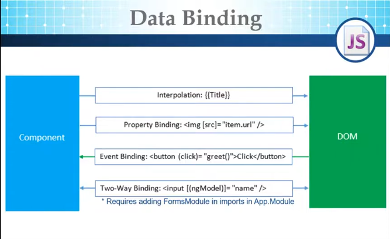

- Create `IProduct` interface in `Models` folder 
- Use this interface to create `Product List` in product component
- Use structure directive `*ngFor` to loop over items 

```TS
export interface IProduct {
    id: number;
    name: string;
    price: number;
    quantity: number;
    imgUrl: string;
    categoryId: number;
}
```

```TS
import { Component } from '@angular/core';
import { IProduct } from '../../../Models/iproduct';

@Component({
  selector: 'app-product-list',
  templateUrl: './product-list.component.html',
  styleUrl: './product-list.component.css'
})
export class ProductListComponent {
	totalPrice: number = 0;
  products: IProduct[] = [
    {id: 100, name: 'HP Laptop', price:300 , quantity: 2, imgUrl:'https://fakeimg.pl/250x100/', categoryId:1},
    {id: 200, name: 'Lenovo Laptop', price:700 , quantity: 0, imgUrl:'https://fakeimg.pl/250x100/', categoryId:1},
    {id: 300, name: 'Ipad 6', price:500 , quantity: 4, imgUrl:'https://fakeimg.pl/250x100/', categoryId:2},
    {id: 400, name: 'Samsung Tab6', price:200 , quantity: 1, imgUrl:'https://fakeimg.pl/250x100/', categoryId:2},
    {id: 400, name: 'Oppo Mobile', price:120 , quantity: 10, imgUrl:'https://fakeimg.pl/250x100/', categoryId:3},
    {id: 400, name: 'Samsung S22', price:400 , quantity: 13, imgUrl:'https://fakeimg.pl/250x100/', categoryId:3},
  ],

buy(productPrice: number, count: string) {
    // casting item count; cuase its value is string

    // let itemsCount : number = Number(count);
    // let itemsCount : number = parseInt(count);
    // let itemsCount : number = count;
    console.log("buy")
    let itemsCount: number = +count;
    this.totalPrice += productPrice * itemsCount;
}
}
```

```TS
<table class="table">
    <thead>
        <tr>
            <th scope="col">#ID</th>
            <th scope="col">Name</th>
            <th scope="col">Price</th>
            <th scope="col">Quantity</th>
            <th scope="col">image</th>
        </tr>
    </thead>
    <tbody>
        <tr *ngFor="let product of products">
            <th scope="row">{{product.id}}</th>
            <td>{{product.name}}</td>
            <td>{{product.price}}</td>
            <!-- Template Variable - a reference of this input-->
            <td><input type="text" #itemCount></td>
            <td><button (click)="buy(product.price, itemCount.value)">Buy</button></td>
        </tr>
    </tbody>
</table>

<h3>Total Price : {{totalPrice}}</h3>
```

 ----
 
### Two Way Binding

Twp way binding means that 'when you change something in controller, it will change in viewer immediately'

It only works with inputs of forms, we use `ngModel` to represent this kind of binding.
`[(ngModel)]`,  it is called banana operator `[()]` . It is a combination of event binding => `()` and property binding => `[]`

*`ngModel` requires adding `FormModule` in imports in `app.module`*

Before two way binding

```TS
<div class="d-flex justify-content-center">
    <label for="select">Category: </label>
    <select #sele class="form-select w-25" aria-label="Default select example" id="select"
            (change) = "updateSelectedCategory(+sele.value)">
        <option *ngFor="let cat of prdCategories" [value]="cat.id">{{cat.name}}</option>
    </select>
    <div class="text-secondary">
        {{showSelectedCategory(selectedCategory)}}
    </div>
</div>
```

After two way binding

```TS
<select class="form-select w-25" aria-label="Default select example" id="select"
            [(ngModel)]="selectedCategory">
			<option *ngFor="let cat of prdCategories" [value]="cat.id">{{cat.name}}
	        </option>
</select>
    <div class="text-secondary">
        {{showSelectedCategory(selectedCategory)}}
    </div>
```

you can consider `mgModel` a keyword refers to the value of the input and any change occurs on this input the `variable` in the controller will be changed to the new value of this input.

---
### Class and style binding

There is two types of class and style binding (single - mutli)

class binding represents adding or removing class.
style binding represents adding or removing css style

Binding to single CSS classes 
``[class.bg-danger]="isEmpty"``
`isEmpty` represents truthy or falsy value.

Binding to multiple CSS classes
`[class]="classExpression"`
`classExpressino` is a property in the TS file. It could be the following
```TS
  classExpression = "table-danger text-primary"
  classExpression1 = "table-border"
  classExpression2 = ["table-danger", "text-primary"]
```


Binding to a single style CSS
`[style.width] = "value"`
`[style.width.px] = "value"`
`value` is a property coming from TS file

Binding to multi style css
`[style]="styleExpression"`


---
### Event binding

```TS
<button (click)="onSave($event)">Save</button>

onSave(event) {
	event.target.value ..... and so on
}
```


