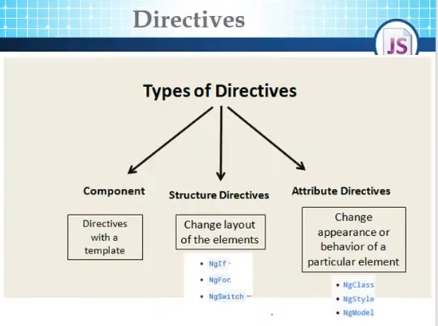

### ngFor

1- ngFor loops over a collection
`let item of collection`

2- ngFor has index variable built in
`let i = index` or `index as i`

3- ngFor has trackBy function that takes index and the current item of the collection (by default)
`trackBy: trackerFn`
```TS
trackerFn(index : number, item: IProduct) {
	// return a unique value that angular will use to mark it
	return item.id;
}
```

`trackBy` function is used to enhance performance, Angular uses the return value to use it as a unique value. That enables Angular to rerender the DOM item that has been changed only.

#### `[hidden = "expression"`

```TS
<tr *ngFor="let product of products" [hidden]="product.id==0">
```

`[hidden]` only hides the component from the DOM, it means it is exising in the dom but it's hidden
### ngIf

ngIF removes the component from the dom while rendering. So, it means that you can't access this compnent later; because it's not in the dom


> [!NOTE] No Structural Directives in the same line
> We can't use more than one structural directives in the same line. In this case we do some work around like using `div` , `span` , `ng-container`

```TS
<tr *ngFor="let product of products">
	<ng-container *ngIf="product.quantity!=0">
		<th scope="row">{{product.id}}</th>
		<td>{{product.name}}</td>
		<td>{{product.price}}</td>
		<td [class.text-danger]="!product.quantity">{{product.quantity}}</td>
		<td></td>
		<td><input type="text" #itemCount></td>
		<td><button (click)="buy(product.price, itemCount.value)">Buy</button></td>
	</ng-container>
</tr>
```


`ng-container` is the best solution cause it is removed from the DOM after rendering. Except `div` or `span` , they still exist in the DOM.


**ngIf lese**

```HTML
<td>
	<div *ngIf="product.quantity; else outOfStock">
		{{product.quantity}}
	</div>
	<ng-template #outOfStock>Out Of Stock</ng-template>
</td>
```


### ngSwitch

```HTML
<tr *ngFor="let product of products">
	<!-- <ng-container *ngIf="product.quantity!=0"> -->
	<th scope="row">{{product.id}}</th>
	<td>{{product.name}}</td>
	<td>{{product.price}}</td>
	<td>
		<div [ngSwitch]="product.quantity">
			<div *ngSwitchCase="1">last item</div>
			<div *ngSwitchCase="0">out of stock</div>
			<div *ngSwitchCase="2">last two items</div>
			<div *ngSwitchDefault>{{product.quantity}}</div>
		</div>
	</td>
	<td></td>
	<td><input type="text" #itemCount></td>
	<td><button (click)="buy(product.price, itemCount.value)">Buy</button></td>
	<!-- </ng-container> -->
</tr>
```

### ngClass

used to add multiple classes with associated with conditions
### ngStyle

used to add multiple styles based on specific conditions


