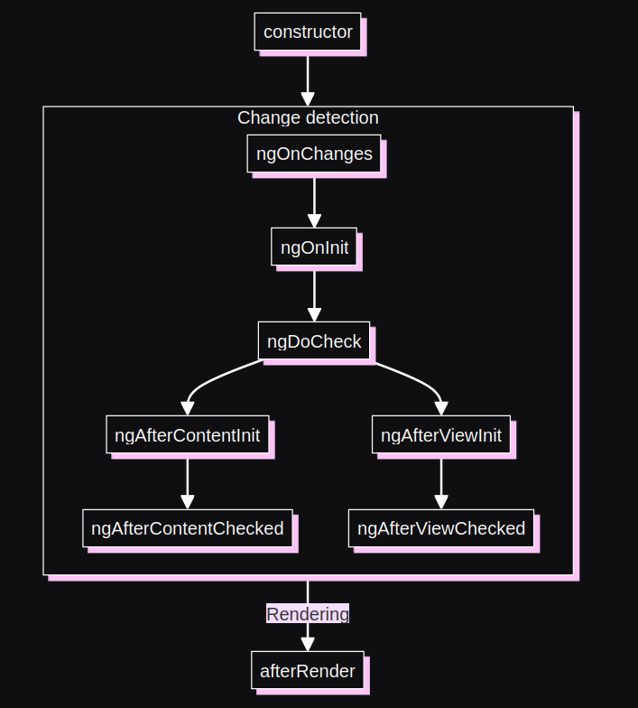

Life cycle hooks

- Constructor is running before any thing, so ==best use of constructor==
	- Initialization of variables
	- Dependency injection

- `ngOnChanges` runs when only if any changes happened to the inputs

```TS
import { Directive, ElementRef, HostListener, Input, OnChanges, OnInit } from '@angular/core';

@Directive({
  selector: '[appLight]'
})
export class LightDirective implements OnInit, OnChanges{
  @Input("appLight") lightColor: string = "yellow";

  constructor(private ele : ElementRef) {
    ele.nativeElement.style.border = `2px solid ${this.lightColor}`;
  }

  ngOnChanges():void {
    this.ele.nativeElement.style.shadow = `1px 1px 1px 1px ${this.lightColor}`
  }

  ngOnInit(): void {
    this.ele.nativeElement.style.border = `2px solid ${this.lightColor}`;
  }

  @HostListener ('mouseover') onMouseOver() {
    // ..
    this.ele.nativeElement.style.padding = "4px";
    this.ele.nativeElement.style.border = `2px solid ${this.lightColor}`
  }

  @HostListener ('mouseout') onMouseOut() {
    // ...
    this.ele.nativeElement.style.padding = "0px"
  }

}
```


==**Comparison**==

ngOnChanges:
- Called whenever an input property changes.
- Useful for responding to changes in input properties.
- Receives a SimpleChanges object containing the current and previous values.

ngOnInit:
- Called once, after the first ngOnChanges.
- Useful for component initialization logic.
- Good place for fetching initial data or setting up initial states.

Example

`parent.component.ts`
```TS
import { Component } from '@angular/core';

@Component({
  selector: 'app-parent',
  template: `
    <app-child [data]="parentData"></app-child>
    <button (click)="updateData()">Update Data</button>
  `
})
export class ParentComponent {
  parentData = 'Initial Data';

  updateData() {
    this.parentData = 'Updated Data';
  }
}
```

`child.component.ts`
```TS
import { Component, Input, OnChanges, SimpleChanges, OnInit } from '@angular/core';

@Component({
  selector: 'app-child',
  template: `<p>{{data}}</p>`
})
export class ChildComponent implements OnChanges, OnInit {
  @Input() data: string;

  ngOnChanges(changes: SimpleChanges) {
    if (changes['data']) {
      console.log('Data changed:', changes['data'].currentValue);
    }
  }

  ngOnInit() {
    console.log('Component initialized with data:', this.data);
  }
}
```