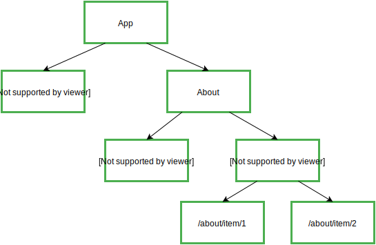

Routing is created while installing and setup Angular. When you choose 'Yes', in case it's asking you to create routing.

It created `app.routing.module` in the `src/app`

We manage routing from this module. I consider routing is all about two concepts {routers , placeholder}

routers is the paths and its components. placeholders is the place which will be changed in the future

`app-routing.module.ts`
```TS
import { NgModule } from '@angular/core';
import { RouterModule, Routes } from '@angular/router';
import { HomeComponent } from './components/home/home.component';
import { ProductListComponent } from './components/order/product-list/product-list.component';
import { OrderMasterComponent } from './components/order/order-master/order-master.component';

const routes: Routes = [
  {path: 'Home', component: HomeComponent},
  {path: "Products", component: ProductListComponent},
  {path: "Order", component: OrderMasterComponent}
];

@NgModule({
  imports: [RouterModule.forRoot(routes)],
  exports: [RouterModule]
})
export class AppRoutingModule { }

```

`app.component.html`
```HTML
<!-- <app-product-list></app-product-list> -->
<!-- <app-header></app-header> -->

<nav class="navbar navbar-expand-lg bg-body-tertiary">
    <div class="container-fluid">
        <a class="navbar-brand" href="#">Store</a>
        <button class="navbar-toggler" type="button" data-bs-toggle="collapse" data-bs-target="#navbarNav" aria-controls="navbarNav" aria-expanded="false" aria-label="Toggle navigation">
        <span class="navbar-toggler-icon"></span>
        </button>
        <div class="collapse navbar-collapse" id="navbarNav">
        <ul class="navbar-nav">
            <li class="nav-item">
            <a class="nav-link active" aria-current="page" routerLink="/Home">Home</a>
            </li>
            <li class="nav-item">
            <a class="nav-link" routerLink="Order">Order Master</a>
            </li>
            <li class="nav-item">
            <a class="nav-link" routerLink="Products">Products</a>
            </li>
            <li class="nav-item">
            <a class="nav-link disabled" aria-disabled="true">Disabled</a>
            </li>
        </ul>
        </div>
    </div>
</nav>

<div class="m-5">
    <!-- <app-order-master></app-order-master> -->
    <router-outlet></router-outlet>
</div>


<section class="">
    <!-- Footer -->
    <footer class="text-center text-white" style="background-color: #0a4275;">
        <!-- Grid container -->
        <div class="container p-4 pb-0">
        <!-- Section: CTA -->
        <section class="">
            <p class="d-flex justify-content-center align-items-center">
            <span class="me-3">Register for free</span>
            <button data-mdb-ripple-init type="button" class="btn btn-outline-light btn-rounded">
                Sign up!
            </button>
            </p>
        </section>
        <!-- Section: CTA -->
        </div>
        <!-- Grid container -->

        <!-- Copyright -->
        <div class="text-center p-3" style="background-color: rgba(0, 0, 0, 0.2);">
        © 2020 Copyright:
        <a class="text-white" href="https://mdbootstrap.com/">MDBootstrap.com</a>
        </div>
        <!-- Copyright -->
    </footer>
    <!-- Footer -->
</section>
```

- `<router-outlet></router-outlet>` : place which its content change based on the URL path
- `<a routerLink="/Home">Home</a>` : changes the URL path
- `<a routerLink="/Home" routerLinkActive="active">Home</a>` : used to apply `active` class when the URL path is running this `routerLink`

### Default Path - Wild Card Path

Routers use "First-match wins" strategy. This means that the order of paths matter.
```TS
const routes: Routes = [ // First-math wins strategy
  // {path: '', component: HomeComponent}, 
  {path: "", redirectTo: "/Home", pathMatch: "full"}, // Default
  {path: "Home", component: HomeComponent},
  {path: "Products", component: ProductListComponent},
  {path: "Order", component: OrderMasterComponent},
  {path: "**", component: NotFoundComponent} // wild card path
];
```

- `redirecTo:` change URL to this value
- `pathMatch` means to match this value with any all value after domain `127.0.0/A/B`
- `path:'**'` means "otherwise"
### Child Routes
`router-outlet` inside `router-outlet`

`app-routing.module.ts`
```TS
const routes: Routes = [ // First-math wins strategy
  // {path: '', component: HomeComponent},
  {path: "", component: MainLayoutComponent, children: [
    {path: "", redirectTo: "/Home", pathMatch: "full"}, // Default
    {path: "Home", component: HomeComponent},
    {path: "Products", component: ProductListComponent},
    {path: "Order", component: OrderMasterComponent},
  ]},
  {path: "Login", component:LoginComponent},
  {path: "**", component: NotFoundComponent} // wild card path
];
```


in Main Component, we have router outlet inside.

```HTML
<div class="m-5 row">
    <!-- <app-order-master></app-order-master> -->
    <aside class="col-2 bg-secondary">
        This is sidebar
    </aside>
    <div class="col-10">
        <router-outlet></router-outlet>
    </div>
</div>


<section class="">
    <!-- Footer -->
    <footer class="text-center text-white" style="background-color: #0a4275;">
        <!-- Copyright -->
        <div class="text-center p-3" style="background-color: rgba(0, 0, 0, 0.2);">
        © 2020 Copyright:
        <a class="text-white" href="https://mdbootstrap.com/">MDBootstrap.com</a>
        </div>
        <!-- Copyright -->
    </footer>
    <!-- Footer -->
</section>

```




### Parameterized Path

To send parameter in URL path , use `:anyName`

```TS
const routes: Routes = [ // First-math wins strategy
  // {path: '', component: HomeComponent},
  {path: "", component: MainLayoutComponent, children: [
    {path: "", redirectTo: "/Home", pathMatch: "full"}, // Default
    {path: "Home", component: HomeComponent},
    {path: "Products", component: ProductListComponent},
    {path: "products/:pid", component: ProductDetailsComponent},
    {path: "Order", component: OrderMasterComponent},
  ]},
  {path: "Login", component:LoginComponent},
  {path: "**", component: NotFoundComponent} // wild card path
];
```

`products.component.html`
```HTML
<td><button class="btn btn-success"(click) = "openProdcutDetails(product.id)">Details</button></td>
```

`prodcuts.component.ts`
```TS

export class ProductListComponent implements OnChanges {

constructor(
    private productListSer: ProductListService,
    private router: Router
  ) {}

 openProdcutDetails(pID: number) {
    this.router.navigate(["/products", pID]);
  }
}
```


**Better Solution : using link**

```HTML
<a class="btn btn-success" [outerLink]="['/Products', product.id]" role="button">
Details
</a>
```

That's better because you don't have to call a function and use the router services and handle this function using click event.

So, it is concise and more readable !! 

