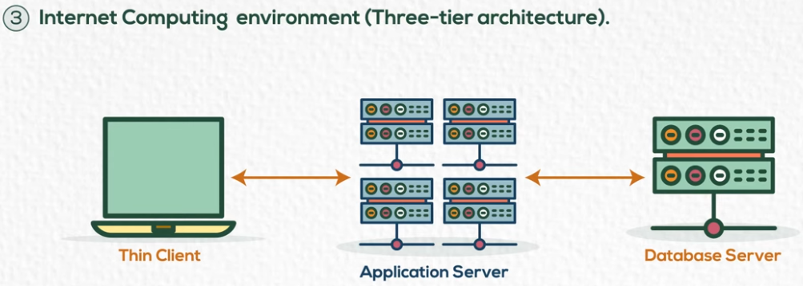

## Components Of DB
- Application (User Interface)
- DB Management System Software
	contains : 
	- Software to process queries
	- Software to access data
- Database 
	- Metadata
		- Metadata contains information about data stored such as column names, table names, DB object structure, log files, constraints, access privileges, username, passwords.
		- It's crucial to integrate with other database systems since it make it easier to transfer data between databases.
	- Stored Data (data itself - values)

## Database Advantages
- Reduce redundancy (all data in one place)
- Enforcing integrity constraints
	- Which means that it guarantee that all data follow the same constrains (all data in phone number column are numbers)
- Inconsistency can be avoid (since data is stored in one place, this means updated data will be available for all users are sharing the same database)
	- Database could be eventually consistent (special case, if we're using distributed databases)
- Providing backup and recovery
	- Database systems can provide databases in comprised files which makes it easier to recover data.
## DBMS Architecture
- Physical Schema (lowest level of abstraction)
	- How data is physically stored in the disk storage
	- Which spaces are allocated and which data stored in these allocated spaces
	- Contains/manages paths of stored data
	- formats : files, indexes, records
- Conceptual Schema
	- How data is stored logically, how data is related to each other, how can you query to get needed data.
- External Schema
	- Creating different schema for all different users. So each use can have access on specific part of data.
	- e.g : A teacher can just see the grades of his students. But admin can see grades of all users

## Why Schema Abstraction -> Data Dependency
- Data dependency means that any changes happens at any layers of schema should NOT effect on other layers.
- e.g: Reallocating data should NOT effect on conceptual schema or external schema

## Data Modeling
- Conceptual data modeling : ERD
- Physical Modeling : how data is stored in storage and describes the path needed to access data
## Mappings
- Mapping : the process of transferring the request and results between schema levels
- Request -> external schema -> conceptual schema -> physical schema
## DBMS Functions
- Simple data like : text/number.
- Multimedia data : images/videos/audios. Some DBMS supports working with these data.
- Spatial Data : data of GIS, locations
- Time : data related to time (such as stock market). Sometimes you need to take snapshot of data at specific range of time.
- Data mining : mining data means to consider all data together to produce insights / decisions. It helps stakeholders to know the flow of the business and how users interacts with market.
	- Clustering, Classification, Association Rules.

## Centralized Database Environment
- Mainframe Environment (1-tier)
	- Application and database server resides on the same machine.
	- It's like you are testing MYSQL locally, so you use the terminal to access or manipulate data.
	- It is super slow, since the database server must be on the same machine.
	- It may cause single point of failure
- Client/Server Environment (2-tier)
	- Split application and database server into different layers
	- Application will be on your machine, database server on other machine
	- It may cause single point of failure since database server resides on single machine
	- It cause a high cost for support, since application must be installed locally to communicate with database server. You have to update each application on each machine if any changes occurred.
	- But application is not single point of failure because it is installed locally
	- Application layer is called **Thick Client**
- Internet Computing Environment (3-tier/n-tier Architecture)
	- 
	- Split Application layer, Client, Database Server into separated layers.
	- Database Server : still resides on single machine -> Single point of failure
	- Application Server : easier to maintain but could cause single point of failure if we don't have multiple application servers work in parallel
		- 3-tier : if we have single application server
		- n-tier : if we have multiple/distributed application servers
	- Thin Client : now, it is thin because it communicates with application server using APIs.
## Distributed Database
- To distribute DB, we can (Replicate OR Fragment)
- **Replication** (Copy - Paste)
	- Full Replica
		- Duplicate the same database many times. Duplicate full database.
		- Signal between them in case one of the database went down, all requested will be rerouted to the running/working one.
		- We have to make all replicated database consistent.
	- Partial Replica
		- Duplicate a part of database.
- Fragment (Cut - Paste)
	- Horizontal (records)
	- Vertical (columns)
	- Hybrid (both of records and columns)