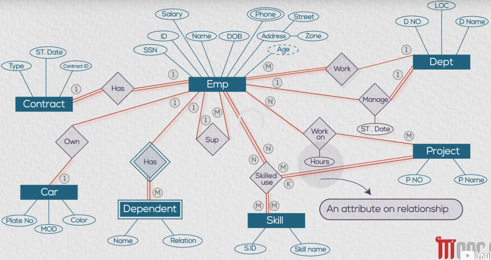

## ERD
Entity Relationships Diagrams - Logical schema - High level Design
## Entity
- String Entity : has an attribute that can distinguish him.
- Weak Entity : does not have a unique attribute, and depends on other entity
- Associative Entity : entity of relationship between two/n entity
## Attributes
- Single
- Composite
- Derived
- Multivalued 
- ***Attribute on a relationship*** : when employees started managing the department.
	- `starting_date` : is related to the relationship `manage` not the `emplyee` or `department` entities
## Relationships Degrees
- 1 : 1
- 1 : M
- M : M
## Participation
- Minimum number of relationship instance that each entity can participate with
- Must : Double line. e.g, department must be managed by employee
- May : Single line. e.g, employee may manage a department

