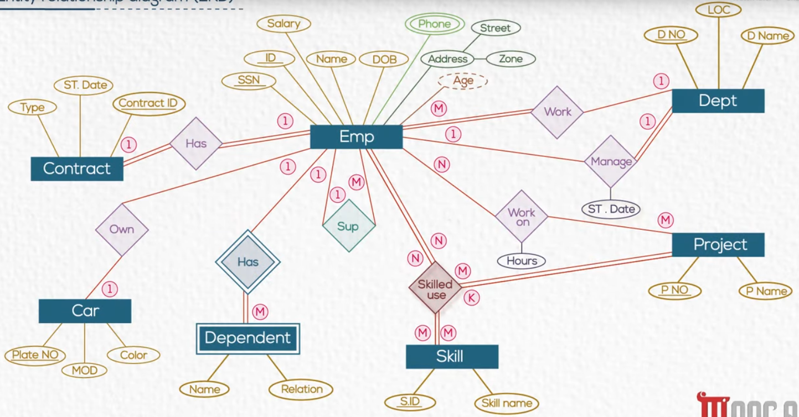

## Mapping Entities

- `Emp(SSN, ID, Salary, Name, DOB, Street, Zone)`
- `Dept(DNO, LOC, D_Name)`
- `Emp_Phone(SSN, phone number)`
- `Project(P_NO, p_name)`
- `Skill(S_ID, skill_name)`
- `Dependent(SSN, Name, Relation)`
- `Contract(Contract_ID, ST_Date, Type)`
- `Car(Plate_NO, Color, MOD)`

## Mapping Relations
- 1:M -> adding FK to N-side table
	- `Emp(SSN, ID, Salary, Name, DOB, Street, Zone, Dept_ID{FK}, Sup_SSN{FK})`
	- `Dependent(SSN{FK}, Name, Relation)`
- M:N -> create new table contains both PKs to create composite PK
	- `Work_On(SSN{FK}, Dept_ID{FK}, hours)`
- 1:1
	- May --()-- Must : *employee manage department*
		- Take `May` primary key and put it as a foreign key in `Must` table
			- `Dept(Manager_SSN{FK}), Start_date, ....)` 
	- May --() May : *employee have a car*
		- It has three solutions : 
		- 1- Put `SSN` in the car table `Car(SSN{FK}, ...)`
		- 2- Put `Plate_NO` in employee table `Employee(SSN, .... Plate_NO)`
		- 3- Create new table `Own(SSN, Plate_NO)`
		- First two approaches are the most recommended
	- Must --()--Must : *employee must have a contract*
		- You must merge them together (Not creating a new table, Just merge each of them in one)
		- `Employee(......, Contract_ID, ST_Date, Type)`
- Ternary Relation
	- Add all  `FKs` in a new table
	- `Skills_Used(Skill_ID{FK}, Project_id{FK}, Emp_SSN{FK})`