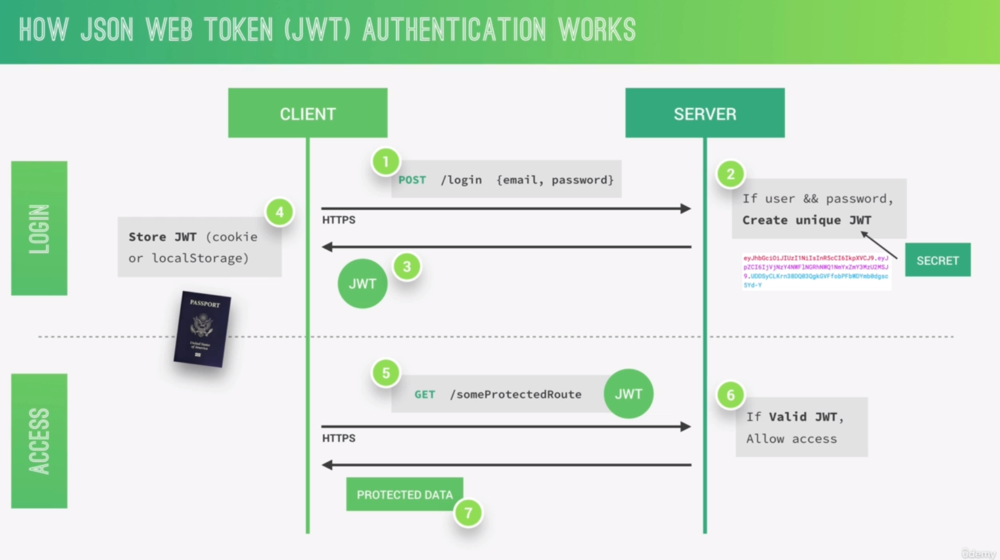
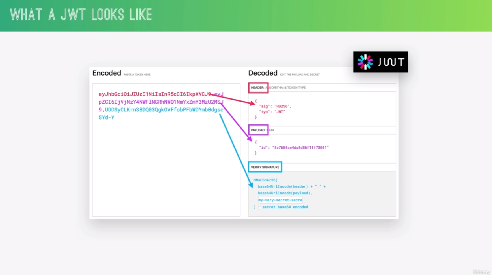
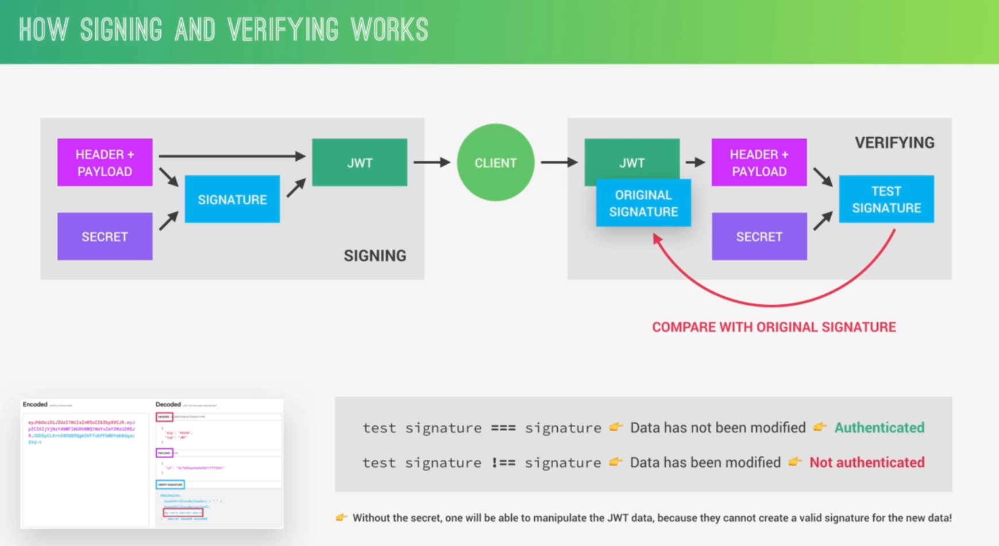
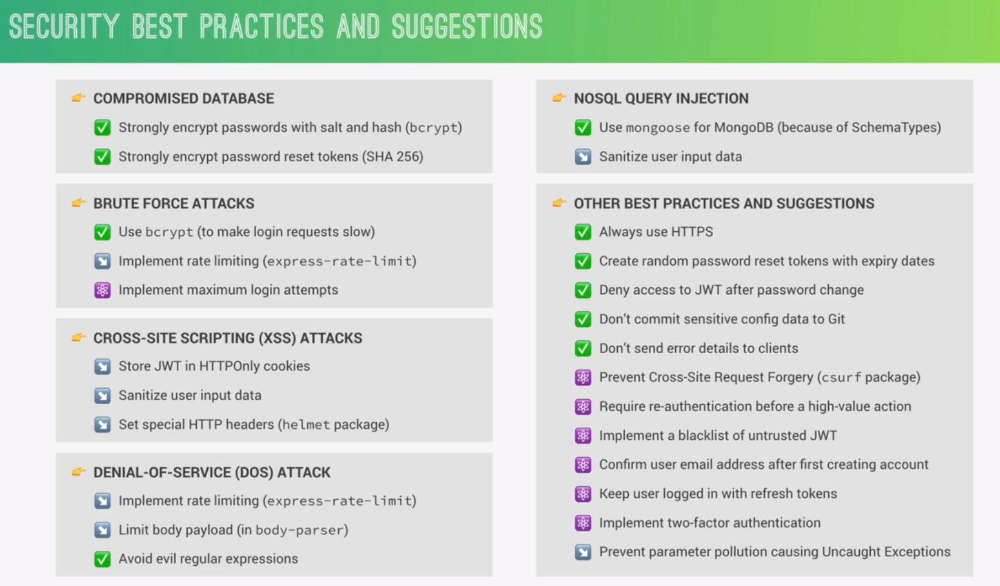

## Modeling User
```js
const mongoose = require("mongoose");
const validator = require('validator');
const bcrypt = require("bcryptjs");

const UserSchema = mongoose.Schema({
    name: {
        type: String,
        required: [true, "User must have a name"]
    },
    email: {
        type: String,
        required: [true, "User must have an email"],
        unique: [true, "This email is already registerd"],
        validate: [validator.isEmail, "Email format is wrong. Must be aa@bb.com"]
    },
    photo: {
        type: String
    },
    password : {
        type: String,
        require: [true, "Password is required"],
        minlength: 8
    },
    confirmedPassword: {
        type: String,
        required: [true, "Confirmatinon password is required"],
        validate: {
            validator: function(val) {
                return this.password === val;
            },
            message: "The passwrod and its confirmation aren't identical"

        }
    }
})

// Document Middleware : Pre save middleware
UserSchema.pre("save", async function (next) {
    // THIS only works if the passwrod field is actually changed
    if (!this.isModified("password")) return next();

    // THIS encrypt the password with cost/salt 12
    this.password = await bcrypt.hash(this.password, 12);

    // IF we want to delete a field from the document, we set it to undedfined
    this.confirmedPassword = undefined

    next();
})

const User = mongoose.model("User", UserSchema);

module.exports = User;
```
## Signup Controller
- It's better to create Authentication controller, that is in charge of doing authentication and authorization.
- That helps us to separate the authentication/authorization logic from the user function like (create, edit, find , delete)

`authController.js`
```js
const User = require("../Models/user");
const catchAsync = require("../utils/catchAsync");

exports.signup = catchAsync(async (req, res, next) => {
    // THIS LINE OF CODE IS A BIG MISTAKE. DON'T STORE ALL DATA USER ENTERS. PREVENT HIME FROM BEING AN ADMIN, FOR EXAMPLE
    // const newUser = await User.create({...req.body});

	// 1. create a user
	const newUser = await User.create({
		name: req.body.name,
		email: req.body.email,
		password: req.body.password,
		confirmedPassword: req.body.confirmedPassword
	});

	res.status(201).json({
		status: "success",
		data: {
			user: newUser
		}
	});
	next();
})
```

- How this works
```js
router.route("/signup", authController.singup)
```
- https request
```bash
..../api/v1/users/signup

{
	name : ..,
	email: ..
	pass: ...
	confirmedPassword: ...
}
```

- response
```
{
	name : ..,
	email: ..
	pass: ...
	confirmedPassword: ...,
	_id: ObjectId()
}
```
## Managing Passwords
 - Passwords cannot be stored in plain text, so we have to encrypt it using `bcryptjs` library
 - Middleware is right place to encrypt the password.
 - Using pre `save` middleware is super efficient to encrypt before saving the document
 - `npm install bcryptjs`
`user.js`
```js
const bcrypt = require("bcryptjs");

UserSchema.pre("save", async function (next) {
    // THIS only works if the passwrod field is actually changed
    if (!this.isModified("password")) return next();

    // THIS encrypt the password with cost/salt 12
    this.password = await bcrypt.hash(this.password, 12);

    // IF we want to delete a field from the document, we set it to undedfined
    this.confirmedPassword = undefined

    next();
})
```
## How Authentication With JWT Works






## Signing Up Users
- Now, we want to send a token to the user when he signs up
- install `jsonwebtoken` library
- use `jwt.sign()` function to create it
- store the secrete key in the `config.env` file
- `npm install jsonwebtoken`

```js
const User = require("../Models/user");
const catchAsync = require("../utils/catchAsync");
const jwt = require("jsonwebtoken");

exports.signup = catchAsync(async (req, res, next) => {
    // THIS LINE OF CODE IS A BIG MISTAKE. DON'T STORE ALL DATA USER ENTERS. PREVENT HIME FROM BEING AN ADMIN, FOR EXAMPLE
    // const newUser = await User.create({...req.body});
    
	const newUser = await User.create({
		name: req.body.name,
		email: req.body.email,
		password: req.body.password,
		confirmedPassword: req.body.confirmedPassword
	});


	// 2. set a token to him
	const token = jwt.sign({id: newUser._id}, process.env.JWT_SECRET, {
		expiresIn: process.env.TOKEN_EXP
	});

	res.status(201).json({
		status: "success",
		token,
		data: {
			user: newUser
		}
	});
	
	next()
})
```


> [!Warning] The previous code has some error
> - If you have any problem with jwt (such as accessing a variable aren't existed in the config file or misspelled)
> -  In that case the document will be created and saved in the collection
> - Token isn't generated
> - Response will be an error, but the user is already created
> - MongoDB Transaction  Solves this problem, ensure the multiple operations are done successfully 

## ==MongoDB Transactions==

#### MongoDB Transactions: A Complete Guide

- MongoDB transactions allow you to execute multiple database operations atomically, meaning that either all operations succeed, or none of them take effect (rollback). This ensures data consistency and prevents partial updates in case of failures.
1️⃣ Why Use Transactions?

- By default, MongoDB operations are independent, meaning:

    If one operation fails, others may still succeed, leading to inconsistent data.
    Transactions group multiple operations into a single unit so that either:
        All succeed (commit) 🟢
        All fail and rollback 🔴

🔹 Example Use Cases:

    User Signup: Ensuring a new user and a session/token are created together.
    Bank Transfers: Ensuring that money is deducted from one account and credited to another.
    E-commerce Orders: Ensuring that stock is updated, order is created, and payment is processed.

2️⃣ How MongoDB Transactions Work

Transactions use sessions to keep track of operations. The steps are:

1️⃣ Start a session
2️⃣ Start a transaction
3️⃣ Perform multiple operations within the transaction
4️⃣ Commit the transaction (if everything is successful)
5️⃣ Abort/Rollback (if something fails)

#### Best Practice: Use a Mongoose Transaction
```js
const mongoose = require("mongoose");
const jwt = require("jsonwebtoken");
const User = require("../models/userModel");
const catchAsync = require("../utils/catchAsync");

exports.signup = catchAsync(async (req, res, next) => {
    const session = await mongoose.startSession(); // Start a transaction
    session.startTransaction();

    try {
        // Create user inside the transaction
        const newUser = await User.create([{
            name: req.body.name,
            email: req.body.email,
            password: req.body.password,
            confirmedPassword: req.body.confirmedPassword
        }], { session });

        // Generate JWT
        const token = jwt.sign({ id: newUser[0]._id }, process.env.JWT_SECRET, {
            expiresIn: process.env.TOKEN_EXP
        });

        // Commit transaction (save user permanently)
        await session.commitTransaction();
        session.endSession();

        res.status(201).json({
            status: "success",
            token,
            data: { user: newUser[0] }
        });
    } catch (error) {
        await session.abortTransaction(); // Rollback if any error occurs
        session.endSession();
        next(error); // Pass the error to global error handling
    }
});

```

5️⃣ When Should You Use Transactions?

✅ Use Transactions If:

    You need multiple related operations to either succeed or fail together.
    Example: Bank transactions, user signup, order creation, stock updates.

❌ Avoid Transactions If:

    Your operations are independent (e.g., inserting logs, updating analytics).
    You are dealing with high-traffic real-time applications (transactions add overhead).


## Logging In Users
## Protecting Tour Routes
## Security and Best Practice

