## Nodejs Architecture

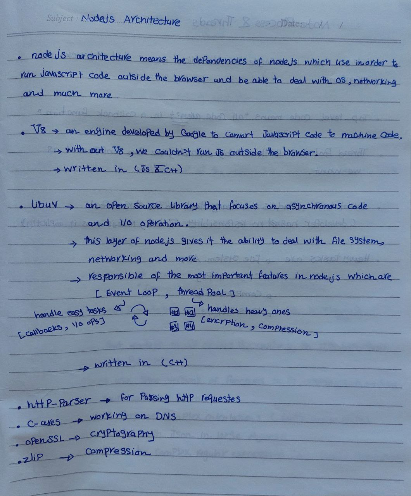

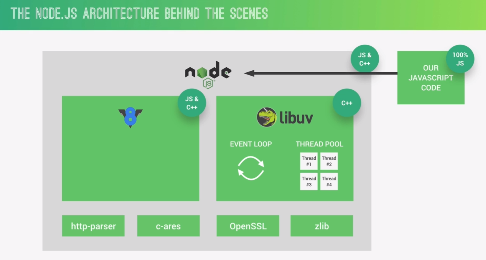

## Nodejs Process And Threads

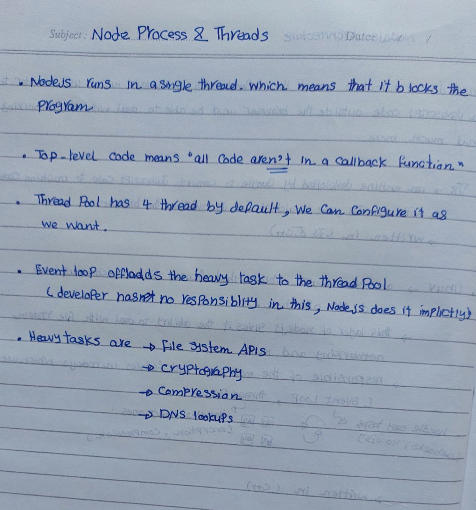

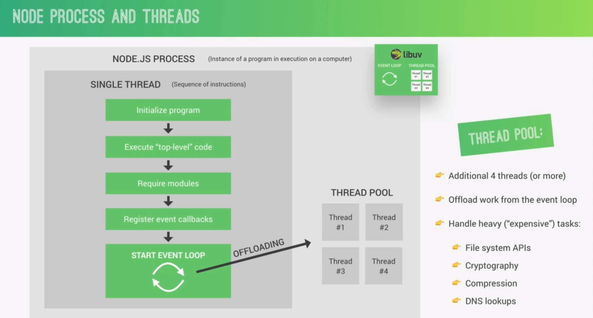

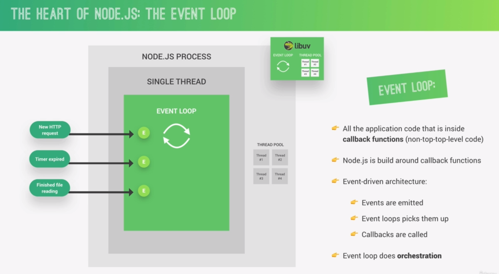
## Event Loop

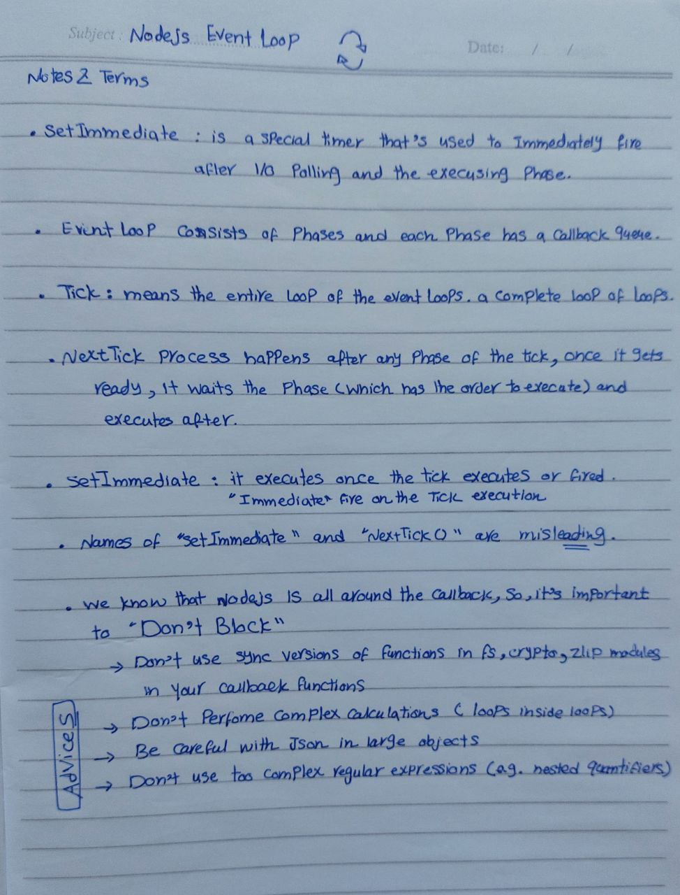

**Nodejs Event Loop Details :** 

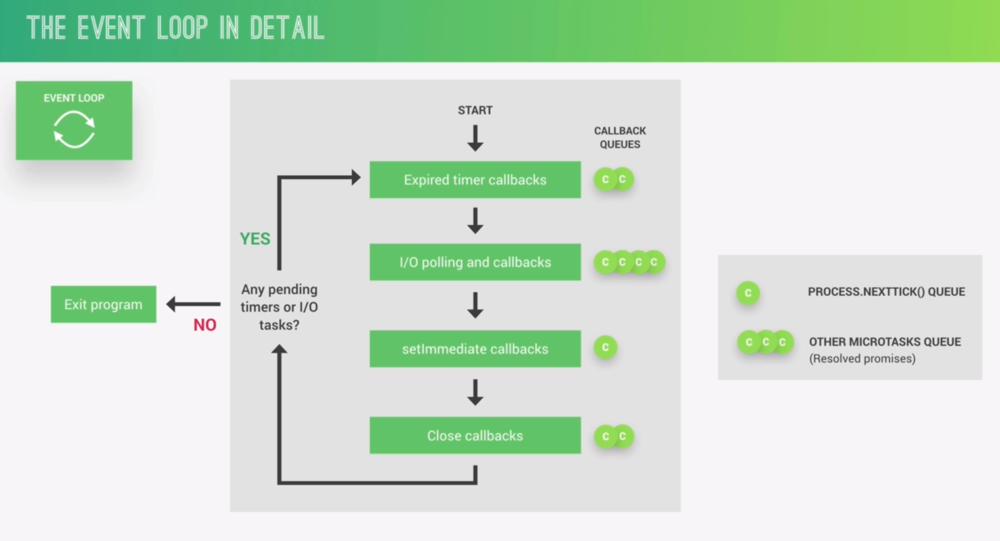

==**Event Loop Practice**== :

```JS
const fs = require("fs");
const crypto = require("crypto");
const start = Date.now();

process.env.UV_THREADPOOL_SIZE = 6;

setTimeout(() => console.log("Timer 1 finished"), 0);
setImmediate(()=> console.log("Setimmediate 1 finished"));

fs.readFile("test-file.txt", "utf-8", (e, d) => {
    console.log("I/O finished");
    console.log("File has be read in " , Date.now() - start , " milliseconds");
    console.log("----------------");

    setTimeout(() => console.log("Timer 2 finished"), 3000);
    setImmediate(()=> console.log("Setimmediate 2 finished"));

    process.nextTick(() => {console.log("NextTick() 1 finsished!!")});

    crypto.pbkdf2("password", "salt", 100000, 1024, "sha512", () => {
        console.log(Date.now() - start, "Password encrypted");
    });

    crypto.pbkdf2("password", "salt", 100000, 1024, "sha512", () => {
        console.log(Date.now() - start, "Password encrypted");
    });

    crypto.pbkdf2("password", "salt", 100000, 1024, "sha512", () => {
        console.log(Date.now() - start, "Password encrypted");
    });

    crypto.pbkdf2("password", "salt", 100000, 1024, "sha512", () => {
        console.log(Date.now() - start, "Password encrypted");
    });

    // thread poll is existed of 4 threads (#, #, #, #);
    // so if we have 5 heavy operations or more, we will notice big varation of the execution time between the first 4 operations and the 5th one

    crypto.pbkdf2("password", "salt", 100000, 1024, "sha512", () => {
        console.log("5th Operation in the thread pool");
        console.log(Date.now() - start, "Password encrypted");
    });

    // we can change the size of the thread pool using (lipu v) functions and properties
})

console.log("Top level code");
```

## Event & Event-Driven Architecture (EDA)

Event Driven Architecture is paradigm in programming that enables to listen to an event an execute function when emitting the event name.

Event is a modules in JavaScript that enables us to do this.

```JS
const eventEmitter = require("events")
```

There is three main parts construct this pattern 
1 -> Event Emitter
2 -> Event Listener
3 -> Callback Function

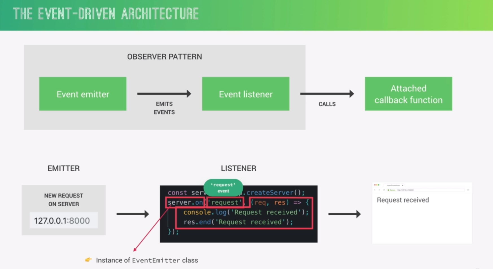

```JS
const EventEmitter = require("events");
const http = require("http");

// const myEventEmitter = new EventEmitter();

// that's how modules like http uses the (events) modules
class MyEventEmitter extends EventEmitter {
    constructor() {
        super();
    }
}

const myEventEmitter = new EventEmitter();

myEventEmitter.on("abdo", () => {
    console.log("hey, i am abdo. what do you want");
})

// we can trigger more than a function when emitting specific event name
myEventEmitter.on("abdo", () => {
    console.log("hey AGAIN , what do you fucking whant");
})

myEventEmitter.on("fire", (e) => {
    console.log(`We have triggers this ${e}, when we listend to the fire event name`);
})

myEventEmitter.emit("abdo");
myEventEmitter.emit("fire", 19);

///////////////////////////

const server = http.createServer();
server.on("request", (req, res) => {
    console.log("Hi, New Request Happened !!");
    console.log(req.url);
    res.end("request !");
})

server.listen(4000, "localhost", () => {
    console.log("server is running");
})
```

## Streams

Streams : <mark style="background: transparent ; color: white; border-bottom: 3px solid #CDC1FF">used to process data (whether read or write) piece by piece (chunks), without completing the whole reading or writing operation, therefore without keeping all data in memory while processing.</mark>

Streams are instances of `EventEmitter` classes. That means, it can listen to named event and execute the attached function.

Types of streams
-> Readable
-> Writable
-> Duplex
-> Transform

|           | description                                                                    | e.g.                                     | important Events    | important functions  |
| --------- | ------------------------------------------------------------------------------ | ---------------------------------------- | ------------------- | -------------------- |
| Readable  | streams from which<br>we can read (consume)<br>data                            | - http request<br>- `fs` read streams    | - data<br>- end     | - pipe()<br>- read() |
| Writable  | stream to which we <br>can write data                                          | - http responses<br>- `fs` write streams | - drain<br>- finish | - write()<br>- end() |
| Duplex    | both readable and <br>writable                                                 | - web sockets                            |                     |                      |
| Transform | duplex streams + <br>it is able to transform <br>data as it is written or read | - `zlip` Gzip creation                   |                     |                      |
**Without using stream :** 
Note : `test-file.txt` is a huge file which is really suitable to use stream to handle it.

```JS
server.on("request", (req, res) => {
    fs.readFile("test-file.txt", (error, data) => {
        if (error) return res.end("Error happened");
        res.end(data);
    })
})
```

**Solution with streams :**
Note : you know stream is an instance of `EventEmitter` class. So there is events names like ==(data, error, end)==. You can listen to theses events to get the chunks immediately

```JS
server.on("request", (req, res) => {
    const readable = fs.createReadStream("testt-file.txt");

    readable.on("data", (chunk) => {
        res.write(chunk);
    })

    readable.on("end", () => {
        res.end();
    })

    readable.on("error", (error) => {
        res.write("Error happened");
        console.log(error);
        res.end();
    })
})
```

## Modules

- Each JavaScript file is treated as a separate module.
- Nodejs uses <span style="border: 1px solid pink; padding: 1px 3px; border-radius:2px">Common JS Module System</span> : `require()` , `exports` or `module.exports`
- ES Module Systems is used in browser : import / export
- There have been attempts to bring ES Modules to Nodejs (`.mjs`)

```JS
require("http")
```

`requrie()` behind the scenes, and where is it coming from ?

Phases of requiring a module :

<span style="background: purple; padding: 1px 3px;">Resolving & Loading</span> -> <span style="background: purple; padding: 1px 3px;">Wrapping</span> -> <span style="background: purple; padding: 1px 3px;">Execute</span> -> <span style="background: purple; padding: 1px 3px;">Returning Exports</span> -> <span style="background: purple; padding: 1px 3px;">Cashing</span>

1.Resolving & Loading
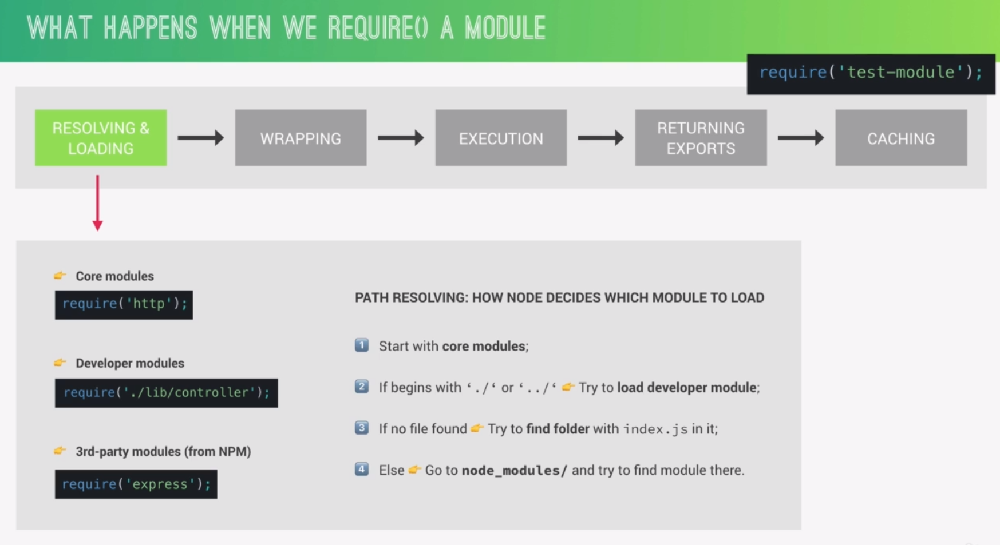

2.Wrapping
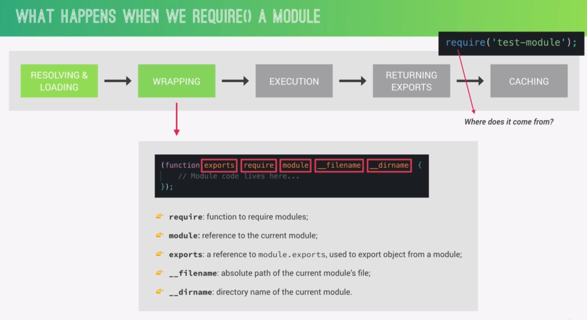
In the runtime, Nodejs wrap the module code inside an IFE (Immediate function execute) and passes important objects like `exports`, `require`, `module` and so on.

This helps to isolate each module and its variable, it also prevent any intersection with other modules variables.

3.Execute
Just execute the function. No thing more

4.Returning Exports
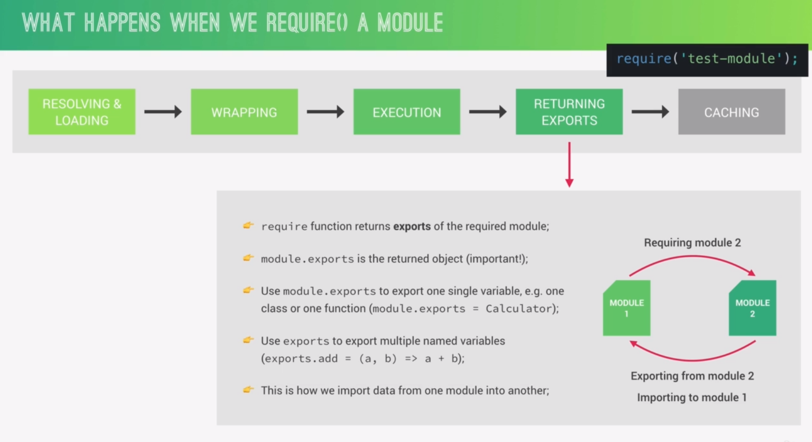

5.Cashing
Modules are cashed in order to use it again.


