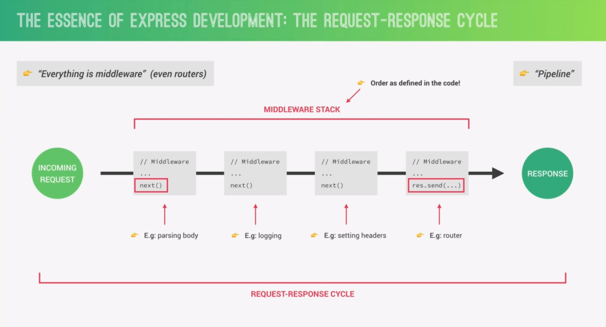

## Setting up express

```JS
const express = require("express");
const app = express();
```

- What is exported from express module?
When you require the "express" module using:

```js
const express = require("express");
```

You are importing a function. This function, when called, returns an Express application object, which is typically named `app`. This function acts as a factory function that creates an instance of an Express application

### Why Do We Call It as a Function?

In Express, the module exports a function that initializes a new application instance. This instance (`app`) is where you define your routes, middleware, and configuration. Here’s the breakdown:

1. **Module Export**: The `"express"` module exports a function.
    
    If you look inside the Express source code, it might look something like this (simplified version):
    
    ```JS
function createApplication() {
  const app = {}; // A new application object (simplified)
  // Setup app properties and methods (like app.get, app.post, etc.)
  return app;
}

module.exports = createApplication;
```
	When you require `"express"`, you get this `createApplication` function.
	
2. **Application Instance**: You call this function to create an application instance.
```JS
const app = express(); // Creates a new Express app instance
```
	This `app` object has methods like `app.get()`, `app.post()`, `app.listen()`, and so on. It is the central object in an Express application.

## Listen to the server
```JS
app.listen(3000, "localhost", () => {
	console.log("server is running!!");
})
```

## Basic routing 
- `get` method from the `app` object
```JS
app.get("/", (req, res) => {
	res.status(200).json({message: "message", code:"code"});
})
  
app.post("/home", (req, res) => {
	res.status(200).send("")
})
```


API : is a piece of code that is used by another software.
## Handling GET request
- response with json data, and use Jsend format

```json
{
    status : "success",
    data : {
        "post" : { "id" : 1, "title" : "A blog post", "body" : "Some useful content" }
     }
}
```

| Type    | Description                                                                                         | Required Keys   | Optional Keys |
| ------- | --------------------------------------------------------------------------------------------------- | --------------- | ------------- |
| success | All went well, and (usually) some data was returned.                                                | status, data    |               |
| fail    | There was a problem with the data submitted, or some pre-condition of the API call wasn't satisfied | status, data    |               |
| error   | An error occurred in processing the request, i.e. an exception was thrown                           | status, message | code, data    |
```js
app.get("/api/v1/tours", (req, res) => {
    res
    .status(200)
    .send({
        status: "success",
        data : {
            tours
        }
    });
})
```


## Handling POST request

- middleware is things that is existed between request and response
- using middleware enables you to deal with request data
- to use middleware, we use `use` function from app object `app.use()`
- `express.json()` is the middleware used to handle incoming data from request

```js
app.use(express.json()); // now we use express.json() middleware

app.post("/api/v1/tours", (req, res) => {
	console.log(req.body); // this will return incoming data not undefined
	res.send("Done")
})
```

- whole example that store the tour in the tours json file.
```js
app.post("/api/v1/tours", (req, res) => {
    // console.log(req.body);
    const id = tours[tours.length - 1].id + 1;
    const newTour = {
        id,
        ...req.body
    };

    tours.push(newTour);

    fs.writeFile(`${__dirname}/dev-data/data/tours-simple.json`, JSON.stringify(tours), error => {
        if (error) {
            return res.status(503).json({
                status: "failed",
                error: "Service unavailable. Please try again later."
            })
        }

        res.status(201).json({
            status: "success",
            data: {
                tour : newTour
            }
        })
    })
})
```


## Responding to URL parameters

- to define a variable (param) in the URL, use `:varName` (e.g `/:id`)
- access on the param using `req.params`

```JS
app.get("/api/v1/tours/:id", (req, res) => {
    const id = +req.params.id;
    const tour = tours.find(t => t.id === id);
    
    if (!tour) {
	    // use return to assure that you will send this only one response
        return res.status(404).json({
            status: "error",
            message: "an error has occurred!!!"
        })
    }
    
    res.status(200).json({
        status: "success",
        data: {
            tour
        }
    }) 
})
```

## Handling patch requests
Super simple
- I've just created a separate function that handle updating tours
- I won't rewrite the json file, because I am fed up

```JS
const updateTours = (id, updatedValues) => {
    let result = null;

    tours.map(tour => {
        if (tour.id === id) {
            tour = {
                ...tour,
                ...updatedValues
            }

            result = tour
        }
    })

    return result;
}
```

That's how you handle patch method

```JS
app.patch("/api/v1/tours/:id", (req, res) => {
    const id = +req.params.id;
    const updatedValues = req.body;
    
    const updatedTour = updateTours(id, updatedValues);

    if (!updatedTour) {
        return res.status(404).json({
            status: "error",
            message: "someting happend!!!"
        })
    }

    res.status(200).json({
        status: "success",
        data: {
            tour: {
                updatedTour
            }
        }
    })
})
```

## Handling delete method
- `204` : this status code means NO CONTENT

```Js
app.delete("/api/v1/tours/:id", (req, res) => {
    const id = +req.params.id;
    if (id > tours.length) {
        return res.status(404).json({
            status: "fail",
            message: "not found data"
        })
    }

    res.status(204).json({
        status: "success",
        message: null // means: don't return anything (NO CONTENT)
    })
})
```

## Refactoring Code
- Create separate function for each route
- use `app.route` to handle all common HTTP method that use same route

This method for `/api/v1/tours`
```JS
const getAllTours = (req, res) => {
    res
    .status(200)
    .send({
        status: "success",
        data : {
            tours
        }
    });
};
```

```JS
app.get("/api/v1/tours", getAllTours);
```


This how to organize methods that share the same route
```JS
app.route("/api/v1/tours")
    .get(getAllTours)
    .post(createTour);
    
app.route("/api/v1/tours/:id")
    .get(getTour)
    .patch(updateTour)
    .delete(deleteTour);
```


## Request & Response cycle



- order of middleware is important. and it is executed as you code it.
- each middleware has `next` function which move the (request & response) object to the next one after processing
- last middleware is `router`, and it has `res.send()` instead of `next` because it sends the response to the client 

## Create our own middleware

- middleware is a function such as `exress.json()`
- middlware function has three argument (request object - response object - next function)
- order of middlware is important
- request - response life cycle ends with `res.json()` / `res.send()`
- putting middleware at the above of the code makes it global

```js
app.use((req, res, next) => {
	console.log("Hello , this is middleware");
	next(); // forgetting this leads to stucking at the middleware stack
})

app.route("api/v1/tours")
	.get(...)
	.post(...)
```

 - manipulate with the request object (here we are adding property called `requestTime`)

```JS
app.use((req, res, next) => {
	req.requestTime = new Date().toISOString();
	next();
})
```

```JS
app.get("api/v1/tours", (req, res) => {
	res.status(200).json({
		status: "success",
		requestedAt: req.requestTime,
		data : {
		..................
		}
	})
})
```

## Using 3rd party middleware
Familiarize yourself with third party middleware such as `morgan` , `body.parser`

## Implementing user routers
- create separate functions that handle these routers
- organize them in Postman (Tours , Users Folders)

```JS
app.route("/api/v1/users")
    .get(getAllUsers)
    .post(createUser);

app.route("/api/v1/users/:id")
    .get(getUser)
    .patch(updateUser)
    .delete(deleteUser);
```

## Creating and mounting multiple routers

The `app.use()` function in Express is a versatile method used for two primary purposes:

1. **Registering Middleware Functions**:
    
    - Middleware functions are functions that execute during the lifecycle of a request, before it is processed by a route handler.
    - Middleware can perform tasks such as parsing request bodies, logging requests, handling authentication, or modifying the request/response objects.
2. **Mounting Routers**:
    
    - Routers allow you to organize your route definitions into modular, reusable pieces.
    - You can mount a router on a specific path using `app.use()`.

We have discussed before how to use it. Now it is time to mount routers.

- Initiate a router using `router = express.Router()`, this is like creating a sub application inside the main application. So instead of using `app.route("/api/tours")` you will use `router.route("api/tours")`
- Use it as a middleware `app.use("/api/tours", router)`

```JS
const tourRouter = express.Router();

app.use("/api/v1/tours", tourRouter);

tourRouter.route("/")
    .get(getAllTours)
    .post(createTour);

tourRouter.route("/:id")
    .get(getTour)
    .patch(updateTour)
    .delete(deleteTour);
```

## A better file structure
Split your code to Routes & Controllers
- create Router folder and put all routes inside it
- create Controller folder and put all router handlers inside it
- create `server.js` file to separate the express application from the server

`Routes/tours.js`
```JS
const express = require("express");
const toursController = require("./../Controllers/tours");

const router = express.Router();

router.route("/")
    .get(toursController.getAllTours)
    .post(toursController.createTour);

router.route("/:id")
    .get(toursController.getTour)
    .patch(toursController.updateTour)
    .delete(toursController.deleteTour);

module.exports = router;
```

`Controllers/tours.js`
```js
const fs = require("fs");

const tours = JSON.parse(fs.readFileSync(`${__dirname}/../dev-data/data/tours-simple.json`));

exports.getAllTours = (req, res) => {};

exports.createTour = (req, res) => {};

exports.getTour = (req, res) => {};

// Helping function to handle updating tours
const updateTours = (id, updatedValues) => {};

exports.updateTour = (req, res) => {};

exports.deleteTour = (req, res) => {};
```

`app.js`
```js
const express = require("express")
const app = express();

app.use("/api/v1/tours", tourRouter);

module.exports = app;
```

`server.js`
```js
const app = require("./app");
app.listen(3000, "localhost", () => {})
```

Then we run the `server.js`
```bash
npx nodemon server.js
```

## Param middleware
When we want to run middleware in a specific router, we use param middlewares. Let's assume that we want to run a middleware on the router that contains `id` parameter to validate if we have any tour with this `id`.

```JS
exprots.validateTour = (req, res, next, id) => {
	const tour = tours.find(t => t.id == id);
	if (!tour) {
		return res.status(404).json({
			status: "fail",
			message: "no tour with this id"
		})
	}

	req.tour = tour;
	next();
}
```

```js
const express = require("express");
const {validateTour} = require("../Middlewares/tour");

const router = express.Router();

router.param("id", validateTour);

router.route("/")
	.get()
	.post()

module.exports = router;
```


## Chain middlwares
- to user more than middleware, separate between them with commas
- `app.use("/api", middleware1, middleware2, middleware3)`
- `app.psot("/api/tour", validateBody, createTour)`

What if we want to implement more than one middleware to specific function. Let's say that we want to check that the input data coming from user to create new tour contains `price` and `name` properties.

- create the middleware inside the middleware floder
- use it in the routes 
- put it before the router handler because of that the order of middlware stack matters (we need to check before creating the tour)


```js
module.exports = (req, res, next) => {
	if (!req.body.hasOwnProperty("price") || !req.body.hasOwnProperty("name")) {
		return res.status(503).json({
			status: "fail",
			message: "tour must have price and name"
		})
	}

	next();
}
```

```js
const validateTourBody = require("./../Middlwares/tours");

router.route("/").post(validateTourBody, tourControllers.createTour);
```

## Serving static file
Use `express.static` middleware to be able to explore the static files through the URL. 

- Specify the file you want to serve it as a static folder

```js
app.use(express.static(`${__dirname}/public`))
```

`127.0.0.1:3000/overview.html`

`overview.html` is a static file inside the public folder (which is specified above in the middleware)


## Environment Variable


