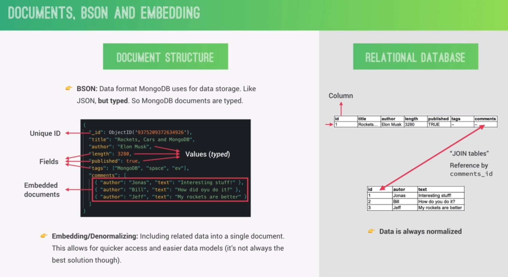

## What is MongoDB

MongoDb is NoSQL database that consists of collections (tables) and these collections consists of documents (rows)
- Collections => Tables
- Documents => Rows

e.g. 
Blog (Collection)  ==> Posts (Documents)
Users (Collection) ==> User (Documents)
Reviews (Collection) ==> User (Documents)

MongoDB is a documents based with scalability and flexibility that you want with querying and indexing that you need

Key Features : 

- **Documents based** : MongoDB stores data in documents (field-value pair data structure, NoSQL)
- **Scalable** : Very easy to distribute data across multiple machines as your users and amount of data grows
- **Flexible** : No document schema required, so each document can have different number and type of fields
- **Performant** : Embedded data models, indexing, sharding, flexible documents, native duplication, etc..
- Free and open source, published under the SSPL License



Normalizing is to reduce the redundancy, achieving it comes through separate the documents or tables to avoid embedding (Denormalizing)

## Installing MongoDB Locally
- Install MongoDB Locally on your device
- Default configuration of Mongo is in `/etc/mongod.conf`
- Don't forget to give the storage and log file the access and move the ownership to `mongodb`

`mongod.conf`
```yaml
storage:
  dbPath: /var/lib/mongodb
systemLog:
  destination: file
  path: /var/log/mongodb/mongod.log
net:
  port: 27017
```

- change the ownership and the mode (write-read-execute) for the storage folder
```shell
sudo mkdir -p /var/lib/mongodb
sudo chown -R mongodb:mongodb /var/lib/mongodb
sudo chmod 700 /var/lib/mongodb
```

- change the ownership and mode for the log file
```shell
sudo mkdir -p /var/log/mongodb
sudo chown -R mongodb:mongodb /var/log/mongodb
sudo chmod 700 /var/log/mongodb
```

- to check status of mongodb server
```shell
sudo systemctl status mongod
```

- to run mongodb server
```shell
sudo systemctl start mongod
```

## CRUD operation with shell

To deal with mongodb with terminal, you need to install `Mongo shell`. You will find it in tools of community edition

- to run mongo shell
```shell
mongosh
```

- to show databases 
```shell
show dbs
```

- to create/switch database
```shell
use natours-test
```

- to create collection
```shell
db.natours-test.tours
```

- to create document
```shell
db.natours-test.tours.insertOne({name: "sphinx", price: 2000, rating: 2.4})
```

- to show collections
```shell
show collections
```

- to search inside collection or document
```shell
db.natours-test.tours.find()
```

- to quit mongo shell
```shell
quit()
```

- insert many documents
```shell
db.tours.insertMany([{name: "Cairo tour", price: 2, rating: 0.2}, {name: "Canada", price: 933, rating: 3.4, difficulty: "easy"}])
```

**NOTE** :: each document created, it will take a random ID and this id is added to the document like this

```yaml
[
  {
    _id: ObjectId('6747b59ef7732df0acc1c18c'),
    name: 'sphinx & pyramids',
    price: 200,
    rating: 4.3
  },
  {
    _id: ObjectId('6747bc15cf9dc9b355c1c18c'),
    name: 'Cairo Tour',
    price: 4,
    rating: 0.3
  },
  {
    _id: ObjectId('6747bc15cf9dc9b355c1c18d'),
    name: 'Canada',
    price: 993,
    rating: 4.7,
    difficulty: 'easy'
  }
]
```


- query on data
In mongo, everything is about document (Object). 

```shell
db.tours.find({name: "Canad"})
```

```shell
db.tours.find({price: {$lte: 200}})
```

`$lte` : less than or equal
`$lt` : less than
`$` : operator for mongo to know that the coming word represents an operator

- AND (query on data that price is less than 200 and rating is less than 1)
```shell
db.tours.find({ price : {$lte: 200} , rating : {$lte: 1} })
```

- OR
```shell
db.tours.find({ $or: 
[
	{price: {$lte: 200}}, 
	{rating: {$lte: 4.5}} 
] 
})
```

- projection : shows only one field-value instead of whole document
```shell
tours.db.find({
$or : [
	{price: {$gt: 200}},
	{rating: {$gte: 4.3}}
]
}, {name: 1})
```

Output -> 

```yaml
[
  {
    _id: ObjectId('6747b59ef7732df0acc1c18c'),
    name: 'sphinx & pyramids',
  },
  {
    _id: ObjectId('6747bc15cf9dc9b355c1c18d'),
    name: 'Canada',
    price: 993,
  }
]
```

- update a document 
	- first -> need to specify the document 
	- second -> `$set` the new field-value 
```shell
db.tours.updateOne({name: "Canada"}, {$set : {name: "Estonia"}})
```

```shell
db.tours.updateOne(
{price: {$gt:500}, rating: {$gte: 4}},
{$set: {name: "abdulazim"}}
)
```

`updateOne()` : update only first document that matches the query
`updateMany()` : update all documents that match the query

`replaceOne()`
`replaceMany()`

- delete a document
```shell
db.tours.deleteOne({rating : {$lte: 4}})
```

- to delete all documents, just query on empty object 
```shell
db.tours.deleteMany({})
```


