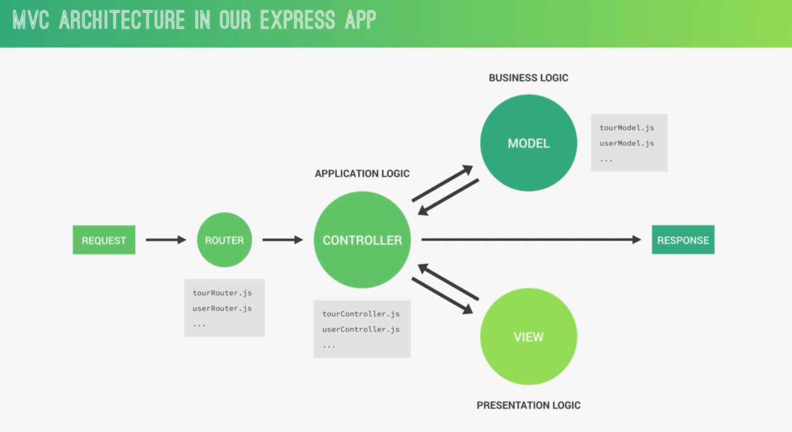
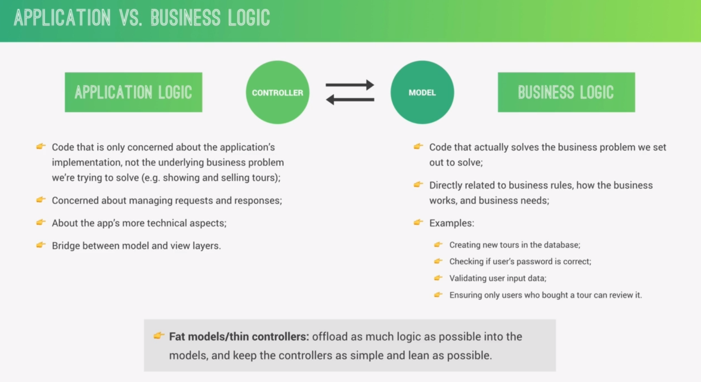

## Connecting database to our application

Steps to connect database : 
- 1 => string connection needed
- 2 => store string connection in the `config.env` file
- 3 => store database password in the `config.env` file (best practice)
- 4 => install mongoose library `npm i mongoose`
- 5 => start connecting

`config.env`

- DATABASE => remote database
- DATABASE_LOCAL => local database (you can connect local or remote)
- DATABASE_PASSWORD => password that will be used later

```env
DATABASE=mongodb+srv://abdorabie14:<db_password>@hera.2uo1e.mongodb.net/?retryWrites=true&w=majority&appName=hera
DATABASE_LOCAL=mongodb://localhost:27017/natours-test
DATABASE_PASSWORD=MY_PASSWORD_I_WONT_WRITE_IT_HERE_OF_COURSE 
```

```js
const mongoose = require("mongoose");
const dotenv = require("dotenv");
const app = require("./app.js")

dotenv.config({path: "./config.env"})

const DB = process.env.DATABASE.replace("<db_password>", process.env.DATABASE_PASSWORD)

mongoose.connect(DB, {
    useNewUrlParser: true,
    useCreateIndex: true,
    useFindAndModify: true
}).then(connectionObj => {
	console.log(connectionObj.connections);
	console.log("database has been connected successfuly!!");
})

app.listen(300, "localhost", () => {
	console.log("server is running")
})
```

- `connect()` function of mongoose returns a promise, so we handle it with `then`


## What is mongoose
- Mongoose is a object data modeling (ODM) for MongoDB and nodejs, a higher level of abstraction.
- Mongoose allows for rapid and simple development of mongodb  database interactions.
- Features : schema to model data and relationships,  easy data validation , simple query API, middleware, etc....
- **Mongoose schema** : where we model our data by describing the structure of the data, default values , and validations.
- **Mongoose model** : a wrapper of schema, providing an interface to the database for CRUD operation
## Creating a simple schema

```js
const tourSchema = mongoose.Schema({
    name : {
        type: String,
        required: [true, "A tour name is a must"],
        unique: true
    },
    price: {
        type: Number,
        required: [true, "A tour price is a must"]
    },
    rating: {
        type: Number,
        default: 0
    }
})
```

- you can use only data type instead of specifying the schema data option object
```js
const tourSchema = mongoose.Schema({
	name: String,
	price: Number,
	rating: Number
})
```

- after you define the schema, you create a model
- model name always start with uppercase (it's a naming convention for models)
```js
const Tour = mongoose.model("Tour", tourSchema)
```

### **Parameters of `mongoose.model()`**

1. **`modelName`**:
    
    - This is the **name of the model**.
    - It is a **string** and serves as an identifier for the collection in MongoDB.
    - **Naming Convention**:
        - Use **singular**, **PascalCase** (e.g., `User`, `Product`, `Tour`).
        - Mongoose will automatically **pluralize** this name to determine the collection name in the database.
            - Example: `mongoose.model("Tour", tourSchema)` maps to the `tours` collection in MongoDB.
    - If you don't want Mongoose to pluralize the name automatically, you can specify a custom collection name in the schema options (discussed below).
2. **`schema`**:
    
    - This is a **Mongoose schema object** that defines the structure of the documents in the model's collection.
    - It acts as a blueprint for the data, defining fields, their data types, default values, validation rules, and more.
        - Example:
```js
const tourSchema = new mongoose.Schema({
  name: { type: String, required: true },
  price: { type: Number, required: true },
  createdAt: { type: Date, default: Date.now },
});

```


## Creating a document and testing model
Now, you will use the model to create a document.
- `save()` function is used to save the document to the database
- `save()` function returns a promise that respond with either the saved document or the error

```js
const Tour = mongoose.model("Tour", tourSchema);

const toursTest = new Tour({
    name: "The Forest Hiker",
    price: 234,
    rating: 3.4
})

toursTest
    .save()
    .then(doc => {
        console.log(doc);
    })
    .catch(error => {
        console.log("Error : ", error);
    })
```


## MVC Architecture , types of logic 

MVC stands for (Model - View - Controller)
- Model -> business logic
- Controller -> application logic
- View -> presentation logic



- Difference between application logic


In real world application we can't separate application logic and business logic, because they may overlap usually.
## Creating model folder

`Models/tour.js`
```js
const mongoose = require("mongoose");

const tourSchema = mongoose.Schema({
    name : {
        type: String,
        required: [true, "A tour name is a must"],
        unique: true
    },
    price: {
        type: Number,
        required: [true, "A tour price is a must"]
    },
    rating: {
        type: Number,
        default: 0
    }
})

const Tour = mongoose.model("Tour", tourSchema);

module.exports = Tour;
```

## Creating Document 

There is tow ways for creating a document.
- using constructor `new Tour({})`
- using `create` method `Tour.create({})`
```js
exports.createTour = (req, res) => {
    const newTour = new Tour({
        ...req.body
    })

    newTour.save()
    .then(savedTour => {
        res.status(201).json({
            status: "success",
            data : {
                tours: savedTour
            }
        })
    })
    .catch(error => {
        res.status.json({
            status: "failed",
            error: error.message
        })
    })
};
```

We can refactor the above code by using `try/catch` instead of `then/catch`

```js
export.createTour = async(req, res) => {
	try {
		const newTour = await Tour.create(req.body); // this creates and save document 

		res.status(201).json({
			status: "success",
			data: newTour
		})
	} catch(error) {
		res.status(400).json({
			message: "fail",
			message: "Can't create a new tour"
		})
	}
}
```

### 1. **`new Tour({}).save()`**

#### How it works:

- You create an instance of the Mongoose model using the `new` keyword and pass the data as an object.
- You then call the `.save()` method on the instance, which validates the data and saves it to the database.

#### Example:

```js
const newTour = new Tour({   name: "Grand Canyon Adventure",   price: 499, }); await newTour.save();
```

#### Use cases:

- **Custom Pre-save Logic**: You can manipulate or modify the document instance (e.g., setting default values or running custom logic) before saving it.
- **Partial Saves**: You can create a document, modify it later, and then save it to persist changes.
- Useful when you need access to the document instance before it’s saved.

#### Features:

- Explicit creation of the document instance allows fine-grained control before saving.
- **Trigger Middleware**: Mongoose `pre` and `post` middleware for `save` are triggered.
- You can save the document at a later point, not immediately.

---

### 2. **`Tour.create()`**

#### How it works:

- `Tour.create()` is a shorthand method that combines the creation and saving steps into one operation.
- You pass the data directly to `create()` as an object, and Mongoose handles both creating the document instance and saving it.

#### Example:

```js
await Tour.create({   name: "Grand Canyon Adventure",   price: 499, });
```

#### Use cases:

- When you don’t need to modify the document or perform operations before saving.
- Ideal for quick and straightforward document creation.

#### Features:

- Combines the creation and save steps in a single call.
- **Trigger Middleware**: Mongoose `pre` and `post` middleware for `save` are **not triggered**, but `pre` and `post` middleware for `insertMany` are triggered.
- Automatically saves the document after creation.

## Reading documents
- `mongoose.model("Tour").find()`
- `mongoose.model("Tour").findById()`

Find all documents
```js
exports.getAllTours = async (req, res) => {
	try {
		const tours_db = await mongoose.model("Tour").find({});
		res
	    .status(200)
	    .send({
	        status: "success",
	        data : {
	            tours: tours_db
	        }
	    });
	} catch(error) {
		res
	    .status(400)
	    .send({
	        status: "fail",
	        message: "Cann't get all tours"
	    });
	}
};
```

get a specific tour <br>
**NOTE** : it is better to create a middleware that checks if the tour is already in database and this middleware assign it as property in the request object `req.tour`
<br>
let's implement the logic inside the handler function
```js
exports.getTour = async (req, res) => {
	try {
		const tour = await Tour.findById(req.params.id);
		res.stauts(200).json({
			status: "success",
			data: {
				tour
			}
		})
	} catch (error) {
		res.status(400).json({
			status: "fail",
			message: "Cann't get this tour ... something happend"
		})
	}
}
```

what if we did this verification in the middleware

```js
router.param("id", toursMiddleware.verifyTour)
```

```js
exports.verifyTour = async (req, res, next, id) {
	try {
		const tour = await mongoose.model("Tour").find({"_id": id});
		req.tour = tour;
	} catch (error) {
		res.status(400).json({
			status: "fail",
			message: "Failed getting the tour"
		})
	}
	
	next();
}
```

## Updating documents
To update a document you can use
- `updateOne()` : return a query
- `findByIdAndUpdate()` : you can add option to return the updated object or the original - also , you can add option to run validators again
- `findOneAndUpdate()`

let's use `findByIdAndUpdate` , it is more powerful 
- first parameter : to find the document
- second parameter : to set updates
- third parameter : to set options
	- `new` option means to return the new (updated) object
	- `runValidators` to validate object before updating (runs schema validations again)

```js
exports.updateTour = async (req, res) => {

    try {
        const updatedTour = await Tour.findByIdAndUpdate(
        {"_id": req.params.id}, 
        {$set : req.body}, 
        {new: true, runValidators: true});

        res.status(202).json({
            status: "success",
            data: {
                updatedTour
            }
        })
    } catch(error) {
        res.status(400).json({
            status: "fail",
            message: error.message
        })
    }
};
```

## Deleting documents
- It is really common in REST API to **not send** any data after `delete` operation

### 1. **`deleteOne()`**

- Deletes **a single document** that matches the filter criteria.
- Returns an object indicating the number of documents deleted.

#### Example:

```js
await Tour.deleteOne({ _id: "someDocumentId" });
```
#### Response:

`{   "acknowledged": true,   "deletedCount": 1 }`

---

### 2. **`deleteMany()`**

- Deletes **all documents** that match the filter criteria.
- Returns an object indicating the number of documents deleted.

#### Example:

```js
await Tour.deleteMany({ destination: "Paris" });
```

#### Response:

`{   "acknowledged": true,   "deletedCount": 3 }`

---

### 3. **`findByIdAndDelete()`**

- Finds a document by its `_id` and deletes it.
- Returns the **deleted document** if found and deleted, or `null` if not found.

#### Example:

```js
const deletedTour = await Tour.findByIdAndDelete("someDocumentId"); console.log(deletedTour); // Logs the deleted document or null
```
---

### 4. **`findOneAndDelete()`**

- Finds a document matching the filter criteria and deletes it.
- Returns the **deleted document** if found and deleted, or `null` if not found.

#### Example:

```js
const deletedTour = await Tour.findOneAndDelete({ destination: "Paris" }); console.log(deletedTour); // Logs the deleted document or null
```

---

### When to Use Each Method

| Method                | Use Case                                                                                   |
| --------------------- | ------------------------------------------------------------------------------------------ |
| `deleteOne()`         | When you want to delete **a specific document** and don't need to return the deleted data. |
| `deleteMany()`        | When you want to delete **multiple documents**.                                            |
| `findByIdAndDelete()` | When you know the `_id` of the document and want to delete it and get its details.         |
| `findOneAndDelete()`  | When you want to delete a document by a filter and also retrieve its details.              |

```js
exports.deleteTour = async (req, res) => {
    try {
        await Tour.findByIdAndDelete(req.params.id);
        res.status(204).json({
            status: "success",
            data: null
        })
    } catch(error) {
        res.status(400).json({
            status: "fail",
            message: error.message
        })
    }
};
```

## Modeling tours
Some properties has been added to the model.

```js
const mongoose = require("mongoose");

const tourSchema = mongoose.Schema({
    name : {
        type: String,
        required: [true, "A tour name is a must"],
        unique: [true, "Tour name is unique and immutable"]
    },
    duration: {
        type: Number,
        required: [true, "A duration is a must"]
    },
    maxGroupSize : {
        type: Number,
        required: [true, "A max group size is a must"]
    },
    difficulty: {
        type: String,
        required: [true, "Difficulty is required"],
        trim: true
    },
    price: {
        type: Number,
        required: [true, "A tour price is a must"]
    },
    ratingAverage: {
        type: Number,
        default: 0
    },
    ratingQuantity: {
        type: Number,
        default: 0
    },
    priceDiscount: {
        type: Number
    },
    summary: {
        type: String,
        required: [true, "Summary is required"],
        trim: true,
    },
    description: {
        type: String,
        required: [true, "Description is required"],
        trim: true,
    },
    imageCover: {
        type: String,
        required: [true, "A tour must have a cover image"]
    },
    images: [String],
    createdAt: {
        type: Date,
        default: Date.now()
    },
    startsAt: [String]

})

const Tour = mongoose.model("Tour", tourSchema);

module.exports = Tour;
```

## Importing development data
Write a script to import/delete all documents to/from the collection.
```js
const fs = require("fs");
const mongoose = require("mongoose");
const Tour = require("./../../Models/tour");
const dotenv = require("dotenv");

dotenv.config({path: "./../../config.env"});

const DB = process.env.DATABASE.replace("<db_password>", process.env.DATABASE_PASSWORD);

const tours = JSON.parse(fs.readFileSync(`${__dirname}/cleaned-tour-data.json`));

mongoose.connect(DB, {
    useNewUrlParser: true,
    useCreateIndex: true,
    useFindAndModify: true,
    useUnifiedTopology: true
}).then(_ => {
    console.log("Database Connected Successfuly");
    importData();
    // deleteData();

})

const importData = async () => {
    try {
        await Tour.insertMany(tours);
        console.log("Tours data imported Successfuly");
    } catch (error) {
        console.log("Cann't import all tours coming from tours");
        console.log(error.message);
    }
}

const deleteData = async () => {
    try {
        await Tour.deleteMany()
        console.log("All data deleted");
    } catch(error) {
        console.log("ERROR : Deleting");
        console.log(error.message);
    }
}
```

## Making API better - filtering
- Express provides `req.query` which return an object of query params
- You can use `find` method from mongodb
- You can use `find().where().equal()` chaining from mongoose 

```js
const {duration, difficulty} = req.query;
const tours_db = await mongoose.model("Tour").find({"duration": duration, "difficulty": difficulty})
```

```js
const {duration, difficulty} = req.query;
const tours_db = await mongoose.model("Tour").find().where("duration").equals(duration).where("difficulty").equals(difficulty);
```

Some times `req.query` will contain properties that doesn't belong to the Tour model. Such as `sorting` which is used for sorting , and `page` which is use for pagnation.

```js
const getAllTours = async () => {
    const excludedFields = ["page", "sort", "limit", "field"];
    const query = {...req.query};
    
    excludedFields.forEach(field => delete query[field]);
    const {duration , difficulty} = req.query;
    
    const tours = await Tour.find(query);
    
    res
    .status(200)
    .send({
        status: "success",
        results: tours_db.length,
        requestedAt: req.requestTime,
        data : {
            tours: tours_db
        }
    });
}
```

**NOTE** : `find` method returns a query which enables use to chain other methods like `where` , `equal`, `method` and much more. After creating a query we can await executing this query to return the object that fits with query.

```js
// Create a query
const reservedFields = ["page", "sort", "limit"];
const queryObj = {...req.query};

reservedFields.forEach(field => delete queryObj[field]);

const query = Tour.find(queryObj);;

// Execute a query
const tours_db = await query;

// Return response
res.status(200).json({
	message: "success",
	data : {
		tours : tours_db
	}
})
```
## Making API better - advanced filtering
Handling `gte`, `gt`, `lte`, `lt`
- To send this operator in the URL
```
127.0.0.1:3000/api/v1/tours?duration[gte]=5&difficulty=easy&page=1&sort=dec
```
`duration[gte]=5` : tours with duration greater than or equal 5

- Then, the query param will be return like this
```
{ duration: { gte: '5' }, difficulty: 'easy' }
```

- We are used to filter using operator by prefixing the `gte` by `$` => `$gte`
```js
Tour.find({duration : {$gte: 5}})
```

- You will need to convert `gte` to `$gte`
	- convert the query object to string
	- use regular expression to replace `gte` or `lte` with `$gte` or `$lte`
```js
let queryStr = JSON.stringify(queryObj);
    queryStr = queryStr.replace(/\b(gte|gt|lte|lt)\b/g, matched => `$${matched}`);

queryObj = JSON.parse(queryStr);

const query = Tour.find(queryObj);
const tours = await query;
```

- To write clean code, you can split it to functions. A one for `convertQueryOperator` and use it inside the handle function of getting all tours.
## Making API better - sorting

- Use `sort` method to apply sort based on properties in the documents
```js
query.sort("price");
```
- To sort descending (from larger -> smaller), prefix `-` before the property name
```js
query.sort("-price");
```
- To sort based on two properties, separate between them with a space. e.g. "price duration"
```js
query.sort("price duration")
```

But how to write query parameters in the URL.
```
127.0.0.1:3000/api/v1/tours?sort=price,duration
```

So we need to convert the `,` into space to pass these properties names to the query.

```js
if (req.query.sort) {
	// if the sort has more than a property, conver "," to space
	let sortingParams = req.query.sort.split(",").join(" ");
	console.log(sortingParams);
	
	// apply sorting by passing properties to sort base on them
	query = query.sort(sortingParams);
}

let tours = await Tour.find(query);
```

You can also sort the documents to ascending order based on the recently created.

```js
if (req.query.sort) {

} else {
	query = query.sort("-createdAt");
}

const tours = await Tour.find(query);
```

## Making API better : limiting fields
- Projection = limiting fields. You can do that by using `query.select()`

- shows only name and price
```js
query.select("name price");
```

- exclude name and price from the response
```js
query.select("-name -price")
```

- another way to do projecting
```js
query.select({name: 1, price: 1, "_id": 0})
```

```js
query.find({}, {name: 1, "_id":0});
```

- URL
```
127.0.0.1/api/tours?fields=name,price,-difficulty
```

```js
if (req.query.fields) {
	// {fields : "name,price,duration"}
	// "name price duration"
	// {name:  1, price: 1, duration: 1}
	let limitingFields = req.query.fields.split(",").join(" ");
	query.select(limitingFields)
} else {
	query.select("-__v"); // execlude this property by default
}
```

- Exclude from the schema
```js
createdAt : {
	type: Date,
	default: Date.now(),
	select: false
}
```

## Making API better : pagination 
- Use `skip()` to skip number of documents
- Use `limit()` to limit returned documents
- Use `countDocuments()` to get number of documents
- URL
```
12.0.0.1:300/api/v1/tours?page=1&limit=2
```

```js
// PAGINATION
	try {
		const page = req.query.page * 1 || 1;
	    const limit = req.query.limit * 1 || 1;
	    const skip = (page-1) * limit;
	    
	    // do pagination all time - weather use asked or not 
		query = query.skip(skip).limit(limit); 
		
	    if (req.query.page) {
		    const toursNum = await Tour.countDcouments();
		    if (skip >= toursNum) throw new Error("Reached the maximum page");
	    }
	} catch (error) {
		// handle response with failure message
	}
```

## Making API better : aliasing
- If you want to make a custom URL to return the top cheapest tours. you will make an alias.
normal URL would be like this
```
127.0.0.1:300/api/tours?sort=price&page=1&limit=5
```
But we want an alias for that
```
127.0.0.1:300/api/tours/top-5-cheap
```

- Middleware comes to solve this problem
- create a middleware that add properties to the `req.query`
- call the handler function 

`middleware/tours.js`
```js
export.topFiveTours = (req, res, next) => {
    req.query = {
        ...req.query,
        sort: "-maxGroupSize,-price",
        limit: "5"
    }
    console.log("Middleware to alias top 5 tours");
    next();
}
```

```js
router.get("/api/top-5-cheap", middlewares.topFiveTours, controllers.getAllTours);
```

## Refactor API features
- create a class to wrap all functions used to handle features of API such as `filter` , `sort`, `pagination`, `fieldslimit`
- The constructor has two parameters `Model` such as Tour and the query object such as `req.query`
- Each methods should return the object to enable method chaining

`utils/apiFeatures.js`
```js
class QueryHandler {
    constructor(model, queryObj) {
        this.model = model;
        this.queryObj = queryObj;
        this.query = null;
    }

    filter() {
        const excludedFields = ["page", "sort", "limit", "fields"];
        let queryObj = {...this.queryObj};
    
        excludedFields.forEach(field => delete queryObj[field]);
    
        console.log(queryObj);
        // Convert Query Operators
        queryObj = JSON.stringify(queryObj);
        queryObj = queryObj.replace(/\b(gte|gt|lte|lt)\b/g, matched => `$${matched}`);
    
        queryObj = JSON.parse(queryObj);

        this.query = this.model.find(queryObj);
        return this;
    }

    sort() {
        if (this.queryObj.sort) {
            let sortingParams = this.queryObj.sort.split(",").join(" ");
            console.log(sortingParams);
    
            this.query = this.query.sort(sortingParams);
        } else {
            this.query = this.query.sort("-createdAt");
        }

        return this;
    }

    fieldsLimt() {
        if (this.queryObj.fields) {
            // {fields : "name,price,duration"}
            // {name:  1, price: 1, duration: 1}
            // let limitingFields = {};
            // this.queryObj.fields.split(",").forEach(field => limitingFields[field] = 1);
            let limitingFields = this.queryObj.fields.split(",").join(" ");
            this.query = this.query.select(limitingFields);
        }

        return this;
    }

    pagination() {
        const page = this.queryObj.page * 1 || 1;
        const limit = this.queryObj.limit * 1 || 1;
        const skip = (page-1) * limit;
        
        // in genral, return chunk of data even the user didn't ask.
        this.query = this.query.skip(skip).limit(limit);
    
        if (this.queryObj.page) {
            // const toursNumber = await this.model.countDocuments();
            // if (toursNumber >= skip) throw new Error("No tours to return")
        }
        
        return this;
    }
}

module.exports = QueryHandler;
```

`contollers/tours.js`
```js
const QueryHandler = require("../utils/apiFeatures");

exports.getAllTours = async (req, res) => {
    try {
        // Execute a query
        const apiHandlerFeatures = new QueryHandler(Tour, req.query).filter().sort().fieldsLimt().pagination();
        const tours_db = await apiHandlerFeatures.query;

        res
        .status(200)
        .send({
            status: "success",
            results: tours_db.length,
            requestedAt: req.requestTime,
            data : {
                tours: tours_db
            }
        });
    } catch (error) {
        res.status(400).json({
            status: "fail",
            message: error.message
        })
    }

};
```

## Aggregation pipeline : matching and grouping
### **Aggregation in MongoDB**

Aggregation in MongoDB is a powerful framework for processing and transforming data stored in collections. It allows you to perform complex operations like filtering, grouping, sorting, calculating, and reshaping data in a highly efficient manner.
<br>
The aggregation framework processes data using a **pipeline**, where multiple stages are applied sequentially. Each stage transforms the data and passes the output to the next stage.
- `$match`
```js
Tour.aggregate([
	{$match : "$price"}
])
```

```js
Tour.aggregate([
	{$match : ratingAverage : {$gte : 4}}
])
```

- `$group` : to group returned document based on a property like "difficulty", "duration"
	- use `_id` to determine which property is used to group
	- `_id: null` don't group any documents
	- `_id: "$difficulty"` : group documents based on difficulty property

```js
Tour.aggregate([
	{$match: ratingAverage : {$gte: 4} },
	{$group : {
		// _id: null
		_id: "$difficulty"
	}}
])
```

 - Reshaping documents
```js
Tour.aggregate([
	{$match: ratingAverage : {$gte: 4}},
	{$group: {
		_id: "$difficulty",
		numOfRatings: {$sum : "$ratingQuantity"},
		avgRating: {$avg : "$ratingAverage"},
		avgPrice: {$avg : "$price"},
		minPrice: {$min : "$price"},
		maxPrice: {$max : "$price"}
	}}
])
```

while the grouping process happens (or after. i don't know). it makes some operation on the documents in the group such as finding the average rating, count of documents, sum of rating quantity, min price between this group, max price and so on ...

- `$sort : {"$property coming from previous pipeline" : 1/-1}` :   
	- `1` : ascending
	- `-1` : descending
```js
Tour.aggregate([
	{$match : ratingAverage : {$gte: 4}},
	{$group: {
		_id: "difficulty",
		count: {$sum : 1},
		avgRating: {$avg: "$ratingAverage"},
		avgPrice: {$avg: "$price"},
		minPrice: {$min: "$price"},
		maxPrice: {$max: "$price"},
	}},
	{$sort: {avgPrice: 1}} // sort 
])
```

- Replicate the operations
	- absolutely you can do `$match` again

```js
	Tour.aggregate([
	{$match : ratingAverage : {$gte: 4}},
	{$group: {
		_id: {$toUpper : "difficulty"},
		count: {$sum : 1},
		avgRating: {$avg: "$ratingAverage"},
		avgPrice: {$avg: "$price"},
		minPrice: {$min: "$price"},
		maxPrice: {$max: "$price"},
	}},
	{$sort: {avgPrice: 1}}, // sort
	{$match: _id : {$ne : "EASY"}}
])
```

==**e.g.**==
```js
exports.toursStats = async (req, res) => {
    try {
        const stats = await Tour.aggregate([
            {$match : {ratingAverage : {$gte: 4}}},
            {$group: {
                _id: {$toUpper : "$difficulty"},
                num: {$sum : 1},
                numOfRatings: {$sum : "$ratingQuantity"},
                avgRating: {$avg : "$ratingAverage"},
                avgPrice: {$avg : "$price"},
                minPrice: {$min : "$price"},
                maxPrice: {$max : "$price"}
            }},
            {$sort : {avgPrice: 1}}
        ]);

        res.status(202).json({
            status: "success",
            results: stats.length,
            data : {
                stats
            }
        })
    } catch (error) {
        res.status(404).json({
            status: "fail",
            message: "Cann't get tours statistics"
        })
    }
}
```

Output : 
```json
{
    "status": "success",
    "results": 2,
    "data": {
        "stats": [
            {
                "_id": "EASY",
                "num": 2,
                "numOfRatings": 7.699999999999999,
                "avgRating": 4.45,
                "avgPrice": 198.5,
                "minPrice": 0,
                "maxPrice": 397
            },
            {
                "_id": "DIFFICULT",
                "num": 2,
                "numOfRatings": 31.4,
                "avgRating": 4.6,
                "avgPrice": 1697,
                "minPrice": 397,
                "maxPrice": 2997
            }
        ]
    }
}
```

## Aggregation pipeline : unwinding and projecting

- `$unwind` is used to split array values into separate documents contains one value of the array
- `$project` is used to project property from the document
- `$addFields`  is used to add fields to each document while aggregating

Business Problem : Write a query which return the number of tours in each month of specific year. e.g. when you write this URL `/monthly-tours/:year` you get the response like this 
```js
[
	{
		"count": 3,
		"tours": [
			"The Sea Explorer",
			"The Forest Hiker",
			"The Sports Lover"
		],
		"month": 7
	},
	{
		"count": 2,
		"tours": [
			"The Star Gazer",
			"The Forest Hiker"
		],
		"month": 10
	}
]
```

**Solution:**
1. Unwind `startsDate` of tours to separate documents
2. Match only tours that are in the specific year
3. Group tours based on the month using `$month` operator of date aggregation
4. Count them using `$sum` operator
5. Create array contains names of tours in the month using `$push` operator

**Stages:** 
- Unwind documents
```js
{$unwind : "$startDates"}
```

- Change format of date (if the format is like this : `2024-01-01T22:24:00`  you don't need to change the format). But if the date looks like this `2024-010-01,22:12:00` you need to format it by adding new field after splitting the string with `,` and accessing the first index in the array
```js
{$addFields : {
	startDatesParsed : {
		dateString: {$arrayEleAt: [{$split: ["$startDates", ","]}, 0]}
	}
}}
```

- Match tours that in the specific year
```js
{ 
	$match: { 
		startDateParsed: { 
			$gte: new Date(`${year}-01-01`), 
			$lte: new Date(`${year}-12-31`) 
		} 
	} 
}
```

- Group them based on month
```js
{
	$group: {
		_id: {$month: "$startDateParsed"},
		count: {$sum: 1},
		tours: {$push: "$name"}
	}
}
```

- full example
```js
exports.monthlyPlan = async (req, res) => {
    try {
        const year = +req.params.year;
        console.log(year);

        const plan = await Tour.aggregate([
            {$unwind : "$startDates"},
            {
                $addFields: {
                    startDateParsed: {
                        $dateFromString: {
                            dateString: { $arrayElemAt: [{ $split: ["$startDates", ","] }, 0] }
                        }
                    }
                }
            },
            { 
                $match: { 
                    startDateParsed: { 
                        $gte: new Date(`${year}-01-01`), 
                        $lte: new Date(`${year}-12-31`) 
                    } 
                } 
            },
            {
                $group: {
                    _id: {$month: "$startDateParsed"},
                    count: {$sum: 1},
                    tours: {$push: "$name"}
                }
            },
            {
                $addFields : {month: "$_id"}
            },
            {
                $sort : {count: -1, month: -1}
            },
            {$project : {_id: 0}}
        ]);

        res.status(202).json({
            status: "success",
            results: plan.length,
            data : {
                plan
            }
        });

    } catch (error) {
        res.status(404).json({
            status: "fail",
            message: "Cann't get tours monthly plan"
        })
    }
}
```

Output : 
```json
{
    "status": "success",
    "results": 9,
    "data": {
        "plan": [
            {
                "count": 3,
                "tours": [
                    "The Sea Explorer",
                    "The Forest Hiker",
                    "The Sports Lover"
                ],
                "month": 7
            },
            {
                "count": 2,
                "tours": [
                    "The Star Gazer",
                    "The Forest Hiker"
                ],
                "month": 10
            }
            ......
```

## Virtual properties 

- Virtual Properties is used to add a new property to the document before saving it in the collection.
- It is the key feature to separate business logic and application logic
	- instead of doing this in the controller, you have to do it in the model

```js
const tourSchema = mongoose.Schema(
{},
{
	toJSON: {virtuals: true},
	toObject: {virtuals: true}
}
);

tourSchema.virtual("durationInWeeks").get(function() {
	return this.duration / 7;
})
```

## Document middleware

- Mongoose has middleware same as Express
- There are three types of middleware in mongoose 
	- document
	- query
	- aggregation
- In the document middleware
	- we can run middleware **before** saving document. before `.save()` / `.create()`
	- we can run middleware **after** saving the document

```js
const tourSchema = mongoose.Schema({....});

tourSchema.pre("save", function(next) {
	console.log("this document will be saved :" , this);
	next();
})

tourSchema.post("save", function(doc, next) {
	console.log("this document has been saved : ", doc);
	next();
})
```

>NOTE: the document middleware doesn't work with `insertMany()` / `insertOne()` / `findByIdAndUpdate()`...

## Query middleware

- Query middleware is executed before or after a certain query executed.
- To executed the middleware before executing use `pre`.
- To execute middleware after the query, use `post`
- the hooks is used to execute the middleware : `find`, `findById`, `findOneAndUpdate`, ...

```js
tourSchema.pre("find", function(next) {
    this.find({secretTour : {$ne: "true"}});
    next();
})
```

The previous middleware will be executed before the query is executed. But it only works with `.find()` query.

- If you're using `findOneAndUpdate()` , you've to specify it or use a regular expression.
```js
tourSchema.pre(/^find/, function(next) {
	this.start = Date.now(); // query is a normal document, so you can add porps
	this.find({ secretTour: {$ne : true} });
	next();
})
```

- Middleware after executing the query
```js
tourSchema.post(/^find/, function(docs, next) {
	console.log(`Retreiving these docs has taken ${Date.now() - this.start}`);
	console.log(docs)
	next();
})
```

## Aggregation middleware

- Call a middleware before any aggregation using `.pre("aggregate", func)`
- It is helpful if you need to exclude some documents before aggregation
- `this` in aggregation stands for the aggregation object ->
```json
Aggregate {
  _pipeline: [
    { '$match': [Object] },
    { '$group': [Object] },
    { '$sort': [Object] }
  ],
  _model: Model { Tour },
  options: {}
}
```

- `aggregationObj.pipeline()` : return an array that contains the stages
- By adding a stage in the front of the array will achieve the approach we need.

```js
aggregationObj.pipeline().unshift({$match: ....})
```

The previous code add a stage before the all stages in the aggregation object which is perfect for our approach

- For sure, this is the array returned  from `pipeline()`
```js
[
  { '$match': { ratingAverage: [Object] } },
  {
    '$group': {
      _id: [Object],
      num: [Object],
      numOfRatings: [Object],
      avgRating: [Object],
      avgPrice: [Object],
      minPrice: [Object],
      maxPrice: [Object]
    }
  },
  { '$sort': { avgPrice: 1 } }
]
```

- Now, let's go through our business logic and apply it.
```js
// AGGREGATION MIDDLEWARE
tourSchema.pre("aggregate", function(next) {
    this.pipeline().unshift({$match : {secretTour : {$ne : true}} });
    console.log(this.pipeline());
    next();
})
```

The previous middleware will make sure that the documents which will be aggregated are not secret tours.

## Data validation : built-in validators
- `minlength` , `maxlength`
```js
name : {
	type: String,
	required: [true, "A tour name is a must"],
	unique: [true, "Tour name is unique and immutable"],
	maxlength: [40, "Tour name length must be less than 40 characters!"],
	minlength: [10, "Tour name can't be less than 10 characters!"]
}
```

- `min` , `max`
```js
ratingAverage: {
	type: Number,
	default: 4.5,
	min: [1.0 , "Rating Average must be above 1.0"],
	max: [5.0 , "Rating Average must be below 5.0"]
}
```

- `enum`
```js
difficulty: {
	type: String,
	required: [true, "Difficulty is required"],
	trim: true,
	enum: {
		values: ["easy", "midium", "difficult"],
		message: "Difficulty is either : easy, medium, difficult"
	}
}
```


> [!NOTE] Array is a shorthand to sepicify the value and message
> `[value, message]` : if the value is single(one) value.
> If the value is array `enum` or anything like this, you've to use the original syntax -> 
> ```js
> enum : {
> 	values: [],
> 	message: ""
> }
> ```


> [!NOTE] Make sure that validator is true
> ```js
> 	const tour = Tour.findByIdAndUpdate(
> 	{"_id": id}, 
> 	{$set : {req.body}},
> 	{new: true, runValidators: true})
> ```

## Data validation : custom validators

- Vlidators check if the price discount is less than the regular price or not.
- Custom validation works only on creating because creating belongs to mongoose but updating belongs to the database and it doesn't create mongoose instance.

```js
price: {
        type: Number,
        required: [true, "A tour price is a must"]
    },
    priceDiscount: {
        type: Number,
        validate: {
            // Only works on creating document.
            // Doesn't work on updating
            validator: function(val) {
                return val < this.price; // 100 < 200
            },
            message: "Discount ({VALUE}) should be less than the price value"    
        }
    }
    .........
    .........
    .........
    
```


## Extra Notes
### Order of executing the middleware functions
1. `pre` of hooks
2. `post` of hooks
3. `router.param(id, validateTour)`
4. last thing run is the handler function in the controller that handles updating tour.

- in `pre` of hook, you have an access to the updated object (the key-values that user submitted to update )
```js
const updatedValues = this.getUpdate();
```


## How to make custom validation in the middleware of `pre(/^find/)`

- I will explain it later, because I am really tired.

```js
tourSchema.pre(/^find/, async function(next) {
    
    if (this.getOptions && this.getOptions()._isInternal) {
        // Skip middleware for internal queries
        return next();
    }

    const updated = this.getUpdate?.();
    
    console.log("pre of find");
    const docToUpdate = await this.model.findOne(this.getQuery(), {}, { _isInternal: true });

    const updatedPrice = updated["$set"].price || docToUpdate.price;
    const updatedPriceDiscound = updated["$set"].priceDiscount || docToUpdate.priceDiscount;

    console.log(`updatedPrice = ${updatedPrice}, updatedPriceDiscount = ${updatedPriceDiscound}`);

    if (updatedPriceDiscound > updatedPrice) {
        next(new Error("Price Discount must be lowwwwwer than the price itself"));
    }
    
    console.log("Query: ", this.getQuery());
    console.log("Document to Update: ", docToUpdate);


    next();
})
```