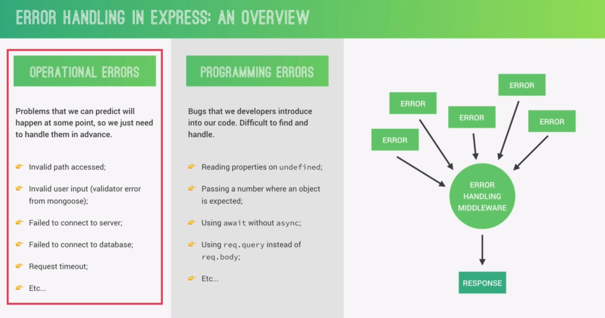

## Handling Unhandled Routes
- If the client send http request through different URL. So i didn't handle this routs and the application will be interrupt.
- You will get HTML or Json response with message error "can't handle this route"

```json
127.0.0.1:300/api/v1111111/blabla
```

- Response : 
```HTML
<!DOCTYPE html>
<html lang="en">
<head>
<meta charset="utf-8">
<title>Error</title>
</head>
<body>
<pre>Cannot GET /api/v1/tourssss</pre>
</body>
</html>
```

- Solution : After handling all routes, we create a middleware function that handle all unhandled routes.
- This function must be the last to be the last in the stack call. This make us completely sure that this route isn't handled before

```js
app.use("/api/v1/tours", tourRouter);
app.use("/api/v1/users", userRouter);

app.all("*", (req, res, next) => {
	res.status(404).json({
	status : "fail",
	message : `Cannpt handle this rout : ${req.originalUrl}`
})
```

## Overview of Error Handling
Express provides a global error handling middleware which receive any error in the application happened during  http request. 

So instead of sending back the status code and message, you create an object from the Error class and send it back, then the error handling middleware will handle it.



## Implementing A Global Error Handling Middleware
- To use error handling middleware, you have to pass a function with four arguments.
- Error first argument.
- By default, Express will configure that this middleware belongs to the error handling.
```js
app.use((error, req, res, next) => {
	error.status = error.status || "error";
    error.statusCode = error.statusCode || 500;

    res.status(error.statusCode).json({
        status: error.status,
        message: error.message
    })
})
```

- How to pass an error to this middleware ? 
```js
app.use("*", (req, res, next) => {
	const error = new Error("Message of error : Cannot handle this route");
	error.status = "Fail";
	error.statusCode = 404;

	next(error);
})
```

- `next` function receive an argument in just one case which is error handling, so it route this to the error handling middleware automatically
- then error handling middleware send the response base on the logic implemented inside its function
## Better Errors And Refactoring
- Instead of creating `new Error` each time and specifying the status and the status code.
- Let's create a class that inherits from `Error` class and add some properties to it.

```js
class AppError extends Error {
	constructor(message, statusCode) {
        super(message);
        this.statusCode = statusCode;
        this.status = `${statusCode}`.startsWith('4') ? "fail" : "error";
        this.isOperational = true;

        Error.captureStackTrace(this, this.constructor); 
        // i don't know why, but we're gonna figure it out later
    }
}

module.exprots = AppError;
```

- `this.isOperational` : will be used later at debugging to know what is the type of error.
- `captureStackTrace` : gives you which file this error comes from
```js
const AppError = require("./utils/appError");

app.all("*", (req, res, next) => {
    // res.status(404).json({
    //     status : "fail",
    //     message : `Cannot handle this rout : ${req.originalUrl}`
    // })
    // const error = new Error(`Cannot handle this rout : ${req.originalUrl}`);
    // error.status = "fail";
    // error.statusCode = 404;

    const error = new AppError(`Cannot Handle THIS ROUTE : ${req.originalUrl}`, 404);
    next(error);
})
```

- Create different file which contains the error function handlers.
`controller/errorController.js`
```js
module.exports = (error, req, res, next) => {
    console.log(error.stack);
    error.status = error.status || "error";
    error.statusCode = error.statusCode || 500;

    res.status(error.statusCode).json({
        status: error.status,
        message: error.message
    })
}
```

## Catching Errors In Async Functions
- Let's get red off all try/catch inside the handlers by creating a high level function which takes the handler as a parameter and handle its errors.
- This makes the handlers more clean and focused on the logic of the function
- This also provides you the ability of handling all errors in one place/file

```js
const catchAsync = fn => {
	 return (req, res, next) => {
		fn(req, res, next).catch(error => next(error));
	 }
}

const createTour = catchAsync(async (req, res, next) => {
	const newTour = await Tour.create({...req.body});
	res.status(200).json({
		status: "success",
		tour: newTour
	})
})
```

- Async function returns a promise, so any error happen in the async function, it could be handled using `catch`.
- ==WHY `catchAsync()` return a function and doesn't run the function and handle the error : because this returned function will be called by Express, so we want to return a function not only run it, we're not in charge to run it. Express is in charge to do it by itself.==

- ==It's better to throw an error instead of sending a response with the error==
- ==Making coding overwhelming is better than making debugging overwheling==
## Adding 404 Not Found Errors
- Instead of returning `null` for not finding a tour or a document, we will return 404 error.
```js
exports.getTour = catchAsync(async (req, res, next) => {
    const tour = await Tour.findById(req.params.id);

    if (!tour) {
        return next(new AppError("There is not tour with that ID", 404));
    }

    res.status(200).json({
        status: "success",
        data: {
            tour
        }
    }) 
});
```
- Do the same thing with `delteTour`, `updateTour` handlers
---
- I was thinking of throwing an error and making the global handling error (`catchAsync`) handles it.
```js
if (!tour) {
	throw new AppError("Cann't find a tour with that ID", 404);
}
```

- But they say that sending the error with `next()` is more explicit and prevent you from making the application crashes
## Error During Development VS Production

```js
const sendErrorDev = (error, res) => {
    res.status(error.statusCode).json({
        error,
        stack: error.stack,
        status: error.status,
        message: error.message,
    })
}

const sendErrorProd = (error, res) => {
    if (error.isOperational) {
        res.status(error.statusCode).json({
            status: error.status,
            message: error.message,
        })
    } else {
        res.status(500).json({
            status: "fail",
            message: "Something went wrong!!!"
        })
    }
}

module.exports = (error, req, res, next) => {
    console.log(error.stack);
    error.status = error.status || "error";
    error.statusCode = error.statusCode || 500;

    if (process.env.NODE_ENV === "development") {
        sendErrorDev(error, res);
    } else if (process.env.NODE_ENV === "production") {
        sendErrorProd(error, res);
    }
}
```

## ==BEFORE NEXT SECTION==
### Question 
i using a global error handling in nodejs application. so when i tried to access invalid ID, the error was handling by the global error handling middleware i've just created. but when i tried to access ID that can't be cast to ObjectId, the application send a response without running or throwing error to the global error handling 

--- response --- 
{ "status": "fail", "message": "Cast to ObjectId failed for value \"wwww\" (type string) at path \"_id\" for model \"Tour\"" } 

--- notes ---- 
the controller which is in charge to read the document : has not been called
### CHAT GPT Answer
This behavior suggests that Mongoose is throwing a CastError before your request even reaches the controller. Since this happens at the query level, your global error handler doesn't catch it.
Why is this happening?

Mongoose automatically validates _id fields when performing queries. If an invalid ID (like "wwww") is used, Mongoose throws a CastError before the controller function is even called. Express error handlers typically only catch errors inside route handlers or middleware, so this error bypasses your global error handler.
How to Fix It?

You need to catch the error before the query is executed. You can do this by adding a middleware function that validates ObjectId before querying the database.
Solution 1: Manually Validate ObjectId Before Querying

Modify your route handler to check whether the provided id is a valid MongoDB ObjectId before executing the database query:

```js
const mongoose = require('mongoose');

const isValidObjectId = (id) => mongoose.Types.ObjectId.isValid(id);

const validateObjectId = (req, res, next) => {
    if (!isValidObjectId(req.params.id)) {
        return next(new AppError('Invalid ID format', 400)); // Pass error to global handler
    }
    next();
};

// Apply this middleware to routes that require an ObjectId
app.get('/api/tours/:id', validateObjectId, async (req, res, next) => {
    try {
        const tour = await Tour.findById(req.params.id);
        if (!tour) return next(new AppError('Tour not found', 404));

        res.status(200).json({
            status: 'success',
            data: { tour }
        });
    } catch (err) {
        next(err);
    }
});
```
👉 This prevents the Mongoose CastError from being thrown and ensures all errors go through your global error handler.

### What I did
I've used middleware of param, when there is a param in the URL request, I use param middleware to check if it is valid or not, then i decide if i will throw the error to the global handling error or not

```js
router.param("id", (req, res, next , id) => {
	if (!mongoose.Types.ObjectId.isValid(id)) {
		return next(new AppError("Sorry !! this cannot be casted"));
	}
})
```
## Handling Invalid Database IDs

