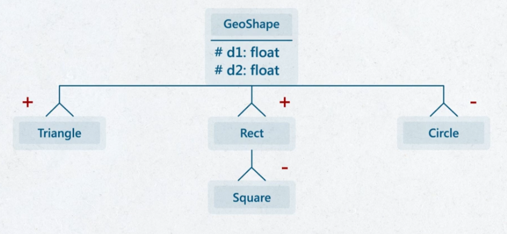
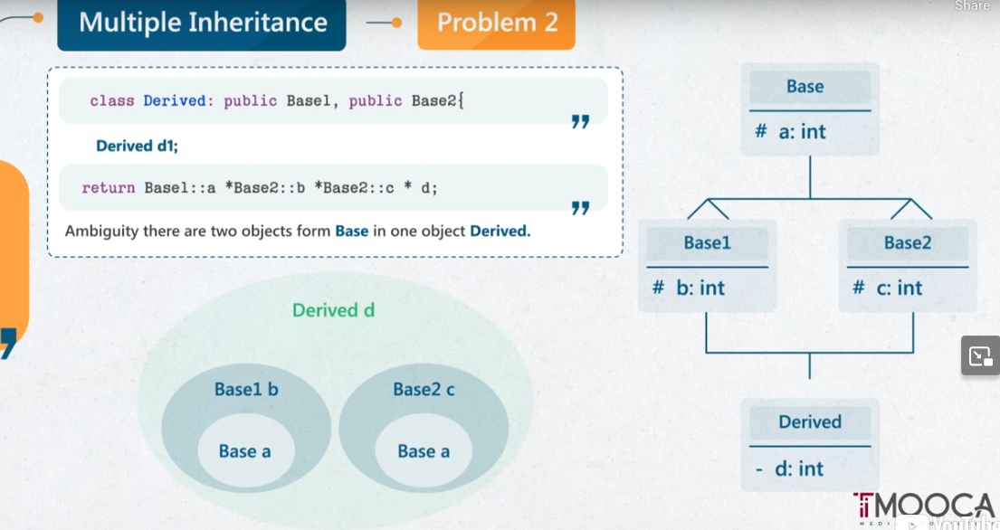

Course : https://maharatech.gov.eg/course/view.php?id=2206
## CH_01: 
- Object size = size of attribute members + link class
## CH_02: 

### Default Parameters in C++
- Start from the most right.
- Gaps are not allowed `sum(2, 3, , 4)`
- `int sum(int x = 0, int y)`  : NOT ALLOWED
-  If you've `int sum(int x, int y = 0)` and `int sum(int x)` which one will be called ?
	- Answer : The code will node execute at all. Compilation Error.
	- Because It is confused for the compiler to decide which version will be called if you fired the function `sum(3)`. 
- `int sum(int x, int y = 0)` =  `int sum(int x)`  in signature.
- Compiler doesn't consider default value in the signature. So both version are equal in signature for compilers

### Constructor & Deconstructor
- If no constructor initialized, compiler will consider that the class has default constructor with empty body
```
class Complex {
}
===
class Comlex {
public: 
	Complex() {};
}
```

### Static Member
- Normal function member has `this` parameter internally by default (implicitly).
- Static function doesn't have `this` , So it cannot deal with normal member function. It deals with static attributes and static functions only.


## CH_03
## Bitwise Copying
- When you pass object by value `void viewContent(Stack st)`
	- It allocates another stack (copy object) and share data with the original one.
```cpp
class Complex {  
    float real, imag;  
  
public:  
    Complex() {  
        cout << "Default Constrcutor called" << endl;  
    };   
    ~Complex() {  
        cout << "Kill Complex" << endl;  
    }
}

void testfun(Complex c) {}

int main() {
	Complex c1; // called default constructor
	testfun(c1);
}
```

Output : 
```
Default Constrcutor called
Kill Complex // destructor of copied in test fun
Kill Complex // destrucotr of c1
```

- ==Problem : It shares same data, SO WHAT IF THERE IS `delete arr[]` in destructor==

## Copy Constructor Solves 'by value'

```cpp
class Complex {  
    float real, imag;  
  
public:  
    Complex() {  
        cout << "Default Constrcutor called" << endl;  
    };  
  
    Complex(Complex& c) {  
        cout << "Copy constructor called .... no bitwise copy" << endl;  
        this->real = c.getReal();  
        this->imag = c.getImag();  
    }  
  
    ~Complex() {  
        cout << "Kill Complex" << endl;  
    }
}

void testfun(Complex c) {}

int main() {
	Complex c1; // called default constructor
	
	testfun(c1);
}
```

Output : 
```
Default Constrcutor called
Copy constructor called .... no bitwise copy
Kill Complex
Kill Complex
```

- That's one of the most important usage of **copy constructor**
- Once compiler find call by value in stand alone function, it called the copy constructor to create copied object and deal with separately.
  
**NOTE** : 
- Once you have dynamic memory allocation in your attributes, always think of copy constructor to avoid bitwise copying.


## CH_04
### Operator overloading
```cpp
class Complex
{
    Complex operator+(Complex);
    Complex operator-(Complex);
    Complex operator+(float);
    friend Complex operator+(float, Complex);  // friend function
    friend Complex operator-(float, Complex);  // friend function
    Complex operator++();
    int operator==(Complex);
    Complex operator++();     // Prefix
    Complex operator++(int);  // Postfix
    operator float();         // casting operator
};
```

## CH_05
## Association
- 'Can use'
- Seminar offer Courses , Then Seminar class will have functions that deals with Course
  
```cpp
class Seminar {
	Course *c;
public:
	void offer(Course *c) {}
}
```


## Aggregation
- **Aggregation is Association but a little bit stronger.**
- **Passing child to container in special method `Constructor`**
  
- If you passed reference in normal method = Association
- If you passed reference in constructor = aggregation
  
- e.g : Company contains many employees
```cpp
class Employee {...}

class Company {
public:
	Company(Employee &e1) {..}
}
```

- You can think of it as : you have a file text `f.txt` when you open this file in Word, you cannot open it in any other program because it's aggregated to Word program. But later can be aggregated/associated with other programs.
  
### Composition
- Strong aggregation
- Rare to find in real systems
- e.g : **House contains rooms, and at least one main room**
```cpp
class Room {}

class House {
	Room mainRoom;
	Room* lroom;
public:
	House() : mainRoom() {
		lroom = new Room[4];
	}
	
	~House {
		delete[] lroom;
	}
}
```
### CH_07

### Inheritance Types

- Implement GeoShape Example :
	- geoshape (public)
	- triangle (public)
	- rectangle (public)
	- square (private)
	- circle (private)
`GeoShape`
```cpp
#pragma once  
  
class GeoShape {  
protected:  
    float d1, d2;  
  
public:  
    GeoShape() {  
        d1 = d2 = 0;  
    }  
  
    GeoShape(float d1, float d2) {  
        this->d1 = d1;  
        this->d2 = d2;  
    }  
  
    float getDim1() {return d1;};  
    float getDim2() {return d2;};  
  
    void setDim1(float d1) {  
        this->d1 = d1;  
    }  
  
    void setDim2(float d2) {  
        this->d2 = d2;  
    }  
  
    virtual float calculateArea() {  
        return d1*d2;  
    }  
};
```

`Triangle`
```cpp
#pragma once  
#include "./GeoSahpe.h"  
  
class Triangle : public GeoShape{  
public:  
    Triangle() : GeoShape() {}  
  
    Triangle(float d1, float d2) : GeoShape(d1, d2) {}  
  
    virtual float calculateArea() {  
        return 0.5f * d1 * d2;  
    }  
};
```

`Rectangle`
```cpp
#pragma once  
#include "GeoSahpe.h"  
  
class Rectangle : public GeoShape{  
public:  
    Rectangle() : GeoShape() {};  
  
    Rectangle(float d1, float d2) : GeoShape(d1, d2) {};  
};
```

`Square`
```cpp
#pragma once  
#include "Rectangle.h"  
  
class Square : private Rectangle {  
public:  
    Square() {};  
  
    Square(float dim) : Rectangle(dim, dim) {};  
  
    float getDim() {  
        return this->getDim1();  
    }  
  
    void setDim(float dim) {  
        this->setDim1(dim);  
        this->setDim2(dim);  
    }  
  
    float calculateArea() {  
        return d1*d2;  
    };  
  
};
```

`Circle`
```cpp
#pragma once  
#include "GeoSahpe.h"  
  
class Circle : private GeoShape{  
private:  
    const float PI = (22.0/7);  
public:  
  
    Circle() {}  
    Circle(float r) : GeoShape(r, r) {};  
  
    float getR() {return this->d1;};  
    void setR(float r) {  
        d1 = d2 = r;  
    }  
  
  
    float calculateArea() {  
        return PI*d1*d2;  
    }  
};
```

### Multiple Inheritance

- Concept isn't provided in modern languages
- Problems : 
	- Two Base classes have same attribute name 
		- Use Scope Operator `Base1::name_of_attr` to specify which is which
	- When Diamond problem happens , Base class will be created ==**twice**==
		- Use `virtual public BaseClass` to terminate creating Base twice.
		- `class Base1 : virtual public Base {}`
		- `class Base2 : virtual public Base {}`
		- This guarantee that `Base` class will initiated one time.

## CH_08
- Dynamic Binding (manipulating with virtual keyword)
- Virtual table
- Pure virtual function `virtual float calcArea() = 0;` to convert class to `abstract class`